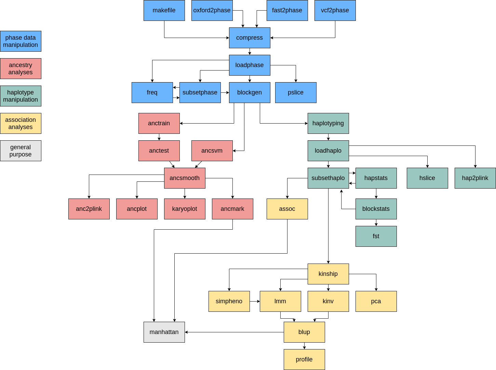

\pagebreak

##Abstract

The **GHap** R package was designed to call haplotypes from phased SNP data. Given user-defined haplotype blocks (HapBlock), the package identifies the different haplotype alleles (HapAllele) present in the data and scores sample haplotype allele genotypes (HapGenotype) based on copy number (i.e., 0, 1 or 2 copies). **GHap** is an acronym for **G**enome-wide **Hap**lotyping, and is pronounced **G**-**Hap**, not gap (although it is intended to fill the gap of haplotype analyses). Apart from its core functionality, the package also supports phenotype-haplotype association analyses as well as machine learning-based predictions of local and global ancestry.

\pagebreak

##Tutorial 1 - Importing phased data

Example input files can be created using the command:

```r
# Copy the example data in the current working directory
library(GHap)
exfiles <- ghap.makefile()
file.copy(from = exfiles, to = "./")
```

The dataset comprises genotypes from the International HapMap Project Phase 3 (The International HapMap 3 Consortium, 2010), which includes 1,011 subjects (from 11 populations) and 20,000 SNPs (randomly sampled from chromosome 2) mapped to the NCBI build 36 (hg18) assembly.

Since version 2.0.0, GHap adopted binary input files for both improved performance and economic data storage. In order to compress the data into a binary file, the user can run:

```r
# Compress phase data
ghap.compress(input.file = "human", out.file = "human")
```

The `ghap.loadphase()` function is responsible for loading phased chromosomes from an input file and converting them into a native **GHap.phase** object. A detailed describtion of this object can be found in the documentation of the function. To load the example data in the package we can run:

```r
#Load phase object
phase <- ghap.loadphase("human")
#   Reading in marker map information... Done.
#   A total of 20000 markers were found in 1 chromosomes.
#   Reading in sample information... Done.
#   A total of 1011 individuals were found in 11 populations.
#   Checking integrity of phased genotypes... Done.
#   Your GHap.phase object was successfully created without apparent errors.
```

Although the example data contains data for a single chromosome, the current version of the package supports multiple chromosomes.

\pagebreak

##Tutorial 2 - Subsetting phased objects

The `ghap.subsetphase()` function can take any combination of markers and individuals and subset the **GHap.phase** object. This is achieved by setting undesired markers and individuals to **FALSE**. Inactivated individuals and markers are then ignored by all other functions taking a **GHap.phase** object as input.

For instance, we know that markers with low polymorphic information content may result in rare HapAlleles. If downstream analyses do not benefit from rare HapAlleles (e.g., haplotype association), it may be advantageous to prune these markers out prior to haplotyping. The code below shows how to subset markers with a minor allele frequency of at least 5%:

```r
# Subset data - markers with maf > 0.05
maf <- ghap.freq(phase, type="maf", ncores = 1)
markers <- names(maf)[which(maf > 0.05)]
phase <- ghap.subsetphase(phase, unique(phase$id), markers)
#   Subsetting 1011 individuals and 17267 markers... Done.
#   Final data contains 1011 individuals and 17267 markers.
```

\pagebreak

##Tutorial 3 - Haplotyping

In principle, the user can provide the coordinates of any arbitrary haplotype block (HapBlock). In **GHap**, we provide means to generate coordinates for HapBlocks based on sliding windows of markers. This strategy is particularly useful in genome-wide scans.

```r
# Generate blocks of 5 markers sliding 5 markers at a time
blocks.mkr <- ghap.blockgen(phase, windowsize = 5, slide = 5, unit = "marker")

# Generate blocks of 100 kb sliding 100 kb at a time
blocks.kb <- ghap.blockgen(phase, windowsize = 100, slide = 100, unit = "kbp")
```

By default all blocks are constrained to a minimum of two markers. This behaviour can be adjusted by setting the *nsnp* argument to a different value. The extent of overlap between consecutive blocks can be controlled via the *slide* argument, depending on how fine the user wishes the genome-wide scan to be. Once HapBlocks have been defined, haplotype genotypes (HapGenotypes) can be determined:

```r
# Generate matrix of haplotype genotypes
ghap.haplotyping(phase, blocks.mkr, outfile = "human", binary = TRUE, ncores = 1)
#   Processing 3453 blocks in:
#   1 batches of 339
#   9 batches of 346
#   3453 blocks written to file
```
By default all HapAlleles are included in the output. If intended, the user can exclude the minor HapAllele by setting the *drop.minor* argument to **TRUE**. Additionally, the *freq* argument allows for exclusion of HapAlleles outside of a specified frequency range. Control of memory usage and process parallelization is achieved through the arguments *batchsize* and *ncores*.

\pagebreak

##Tutorial 4 - Importing and manipulating haplotype data

After HapAlleles have been scored, the data can be loaded into R using the `ghap.loadhaplo` function:

```r
# Load haplotype genotypes
haplo <- ghap.loadhaplo("human")
#   Reading in haplotype allele information... Done.
#   A total of 60002 haplotype alleles were found.
#   Reading in sample information... Done.
#   A total of 1011 individuals were found in 11 populations.
#   Checking integrity of haplotype genotypes... Done.
#   Your GHap.haplo object was successfully loaded without apparent errors.
```

Similar to the **GHap.phase** object, the user can also subset **GHap.haplo** objects. For instance:

```r
# Randomly select 500 individuals
ids <- sample(x = haplo$id, size = 500, replace = FALSE)

# Subset data
haplo.sub <- ghap.subsethaplo(haplo,ids,haplo$allele.in)
#   Subsetting 500 individuals and 60002 haplotype alleles... Done.
#   Final data contains 500 individuals and 60002 haplotype alleles.

# Restore selection of the entire data
haplo.sub <- ghap.subsethaplo(haplo,unique(haplo$id),rep(TRUE,times=haplo$nalleles))
#   Subsetting 1011 individuals and 60002 haplotype alleles... Done.
#   Final data contains 1011 individuals and 60002 haplotype alleles.
```
\pagebreak

##Tutorial 5 - Haplotype statistics

For each HapAllele, the `ghap.hapstats` function retrieves absolute and relative frequencies, expected and observed number of homozygotes, and different tests for deficit of homozygotes in comparison to Hardy-Weinberg Equilibrium (HWE) expectations.

```r
hapstats <- ghap.hapstats(haplo, ncores = 1)
#   Processing 60002 HapAlleles in 10 batches.
#   Inactive alleles will be ignored.
#   60002 alleles processed
str(hapstats)
#   'data.frame':	60002 obs. of  14 variables:
#    $ BLOCK   : chr  "CHR2_B1" "CHR2_B1" "CHR2_B1" "CHR2_B1" ...
#    $ CHR     : chr  "2" "2" "2" "2" ...
#    $ BP1     : num  18228 18228 18228 18228 18228 ...
#    $ BP2     : num  75360 75360 75360 75360 75360 ...
#    $ ALLELE  : chr  "ATAGT" "ATAAC" "ATGGC" "GGAAC" ...
#    $ N       : num  2 4 5 10 42 ...
#    $ FREQ    : num  0.000989 0.001978 0.002473 0.004946 0.020772 ...
#    $ O.HOM   : num  0 0 0 0 0 1 14 17 14 524 ...
#    $ O.HET   : num  2 4 5 10 42 56 123 142 170 328 ...
#    $ E.HOM   : num  0.000989 0.003956 0.006182 0.024728 0.436202 ...
#    $ RATIO   : num  1 1 1.01 1.02 1.44 ...
#    $ BIN.logP: num  0.00043 0.00172 0.00268 0.01074 0.18948 ...
#    $ POI.logP: num  0.00043 0.00172 0.00268 0.01074 0.18944 ...
#    $ TYPE    : chr  "MINOR" "REGULAR" "REGULAR" "REGULAR" ...
```

The function also assigns a *TYPE* category to each HapAllele:

"ABSENT" = the frequency of the allele is 0;

"SINGLETON" = unique haplotype of its block with frequency 1 (i.e., monomorphic block);

"MINOR" = the least frequent haplotype of its block (in the case of ties, only the first haplotype is marked);

"MAJOR" = the most frequent hapotype of its block (ties are also resolved by marking the first haplotype);

"REGULAR" = the haplotype does not fall into any of the previous categories.

Categories "SINGLETON", "MINOR" and "MAJOR" only apply to blocks where frequencies sum to 1.

The `ghap.blockstats` function summarizes HapAllele statistics per block and retrieves the expected heterozygosity and the number of alleles per HapBlock. For instance:

```r
blockstats <- ghap.blockstats(hapstats, ncores = 1)
head(blockstats,n=2)
#        BLOCK CHR   BP1    BP2     EXP.H N.ALLELES
#   1  CHR2_B1   2 18228  75360 0.5128683        10
#   11 CHR2_B2   2 90190 109437 0.7139595        15
```

Notice that calculation of expected heterozygosity will not be reliable when HapAlleles are prunned out by frequency during haplotyping. Therefore, the function will return NA for blocks where HapAllele frequencies do not sum to unity. Also, when the dataset contains multiple populations the expected heterozygosity and the number of alleles will be very high.

\pagebreak

##Tutorial 6 - Relationship matrix and PCA

The example below computes a kinship matrix from HapGenotypes and plots the first two eigenvectors of a principal components analysis of this matrix. Notice that absent, singleton and minor alleles should be excluded from computations.

```r
# Exclude minor alleles and singletons
haplo <- ghap.subsethaplo(haplo,haplo$id, hapstats$TYPE %in% c("REGULAR","MAJOR"))
#   Subsetting 1011 individuals and 56572 haplotype alleles... Done.
#   Final data contains 1011 individuals and 56572 haplotype alleles.

# Compute Kinship matrix
K <- ghap.kinship(haplo, ncores = 1)
#   Processing 56572 HapAlleles in 10 batches.
#   Inactive alleles will be ignored.
#   Preparing 1011 x 1011 kinship matrix.
#   56572 HapAlleles processed.

# PCA analysis
pca <- ghap.pca(haplo,K)

# Plot
plot(x=pca$eigenvec$PC1, y=pca$eigenvec$PC2, xlab="PC1", ylab="PC2", pch="")
pop <- pca$eigenvec$POP
pop.col <- as.numeric(as.factor(pop))
pop <- sort(unique(pop))
legend("bottomleft", legend = pop, col = 1:length(pop), pch = 1:length(pop), ncol = 3)
points(x=pca$eigenvec$PC1, y=pca$eigenvec$PC2, pch = pop.col, col = pop.col, cex = 1.2)
```
\pagebreak

##Tutorial 7 - Haplotype divergence analysis

The example below compares the CEU and CHB populations for HapBlocks on chromosome 2: 

```r
# Compute haplotype allele statistics for each group
haplo <- ghap.subsethaplo(haplo,haplo$id,rep(TRUE,times=haplo$nalleles))
CHB.ids <- haplo$id[which(haplo$pop=="CHB")]
CEU.ids <- haplo$id[which(haplo$pop=="CEU")]
haplo <- ghap.subsethaplo(haplo,CHB.ids,haplo$allele.in)
CHB.hapstats <- ghap.hapstats(haplo,ncores = 1)
haplo <- ghap.subsethaplo(haplo,CEU.ids,haplo$allele.in)
CEU.hapstats <- ghap.hapstats(haplo,ncores = 1)
haplo <- ghap.subsethaplo(haplo,c(CHB.ids,CEU.ids),haplo$allele.in)
TOT.hapstats <- ghap.hapstats(haplo,ncores = 1)
haplo <- ghap.subsethaplo(haplo,haplo$id,rep(TRUE,times=haplo$nalleles))

# Compute haplotype block statistics for each group
CHB.blockstats <- ghap.blockstats(CHB.hapstats, ncores = 1)
CEU.blockstats <- ghap.blockstats(CEU.hapstats, ncores = 1)
TOT.blockstats <- ghap.blockstats(TOT.hapstats, ncores = 1)

# Calculate Fst
fst <- ghap.fst(CHB.blockstats, CEU.blockstats, TOT.blockstats)

# Plot results
top.fst <- fst[fst$FST == max(fst$FST, na.rm=TRUE),]
plot(
 x = (fst$BP1+fst$BP2)/2e+6,
 y = fst$FST, pch = "",
 ylab = expression(paste("Haplotype ", F[ST])),
 xlab = "Chromosome 2 (in Mb)",
 ylim=c(0,1)
)
abline(v=108.7, col="gray")
points(x = (fst$BP1+fst$BP2)/2e+6, y = fst$FST, pch = 20, col="#471FAA99")
points(x = (top.fst$BP1+top.fst$BP2)/2e+6, y = top.fst$FST, pch = 20, col="red")
text(x = 125, y = max(fst$FST, na.rm=TRUE), "EDAR", col="red")
```

Ideally, similar to the case of HapAllele and HapBlock statistics, the $F_{ST}$ analysis should be carried out on the full set of HapAlleles, rather than a frequency-prunned subset.

\pagebreak

##Tutorial 8 - Haplotype ancestry

The package provides three methods for the prediction of haplotype ancestry:

**GHap Unsupervised**. This method does not require a reference sample. It is based on a combination of K-means and heuristics, and is divided into three steps. In the first one, a random sample of seeding markers (default value of nmarkers = 5000) is used to group all 2\*nsamples haplotypes in a user-specified number of clusters (default value of K = 2). Then, for each interrogated block, prototype alleles (i.e., centroids) are built for every cluster using the mean of observed haplotypes initially assigned to that cluster. Finally, each tested haplotype is assigned to the nearest centroid (i.e., with the smallest Euclidean distance). K-means is internally ran through the `kmeans` function in the **stats** package.

**GHap Supervised**. This method is similar to the 'unsupervised' method, only replacing the K-means clutering step by user-defined clusters of reference samples.

**Support Vector Machines (SVM)**. This method performs predictions using Support Vector Machines (SVM) together with a Gaussian Radial Basis Function (RBF) kernel. The user is required to specify a reference sample of individuals with known ancestry labels. The reference sample is then used to train the SVM model, which is parameterized by the C constant of the regularization term in the Lagrange formulation (default cost = 1) and the gamma parameter (default gamma = 1/blocksize) of the RBF kernel. Fitting of SVM is performed internally by the `svm` function from the **e1071** package. Test samples have the ancestries of their HapAlleles predicted using the fitted SVM.

In all three methods, the classifiers assume exactly one ancestry per HapBlock, such that segments encompassing breakpoints are miss-classified as pertaining to a single ancestral origin, as opposed to a recombinant mixture of hybrid ancestries. When any of the three methods is ran with overlapping HapBlocks, the user should use the `ghap.ancsmooth` function to convert HapAllele classifications into ancestry tracks. In this case, the smoothing function interrogates the ancestry of each overlapped segment by majority voting of all blocks containing it. After the ancestry of all segments have been resolved, contiguous sites sharing the same classification are converted into runs or segments of ancestry, which comprise the final output of an ancestry analysis. The following lines of code show an analysis of the HapMap3 data considering the three major ancestry components in human populations: the continental blocks of Africa, Europe and Asia.

```r
# Calculate marker density
mrkdist <- diff(phase$bp)
mrkdist <- mrkdist[which(mrkdist > 0)]
density <- mean(mrkdist)

# Generate blocks for admixture events up to g = 10 generations in the past
# Assuming mean block size in Morgans of 1/(2*g)
# Approximating 1 Morgan ~ 100 Mbp
g <- 10
window <- (100e+6)/(2*g)
window <- ceiling(window/density)
step <- ceiling(window/4)
blocks <- ghap.blockgen(phase, windowsize = window, slide = step, unit = "marker")

# Unsupervised analysis
prototypes1 <- ghap.anctrain(phase = phase, K = 3, ncores = 1)
hapadmix1 <- ghap.anctest(phase = phase, blocks = blocks, prototypes = prototypes1,
                         test = unique(phase$id), ncores = 1)
anctracks1 <- ghap.ancsmooth(phase = phase, admix = hapadmix1, ncores = 1)

# User-defined labels
pops <- phase$pop
labels <- pops
labels[which(labels %in% c("CEU","TSI"))] <- "Europe"
labels[which(labels %in% c("CHB","JPT","CHD"))] <- "Asia"
labels[which(labels %in% c("YRI","LWK"))] <- "Africa"
labels[which(labels %in% c("MKK","GIH","ASW","MEX"))] <- "Test"
phase$pop <- labels
train <- unique(phase$id[which(phase$pop != "Test")])
test <- unique(phase$id)

# Supervised analysis with default parameters
prototypes2 <- ghap.anctrain(phase = phase, train = train,
                             method = "supervised", ncores = 1)
hapadmix2 <- ghap.anctest(phase = phase, blocks = blocks, prototypes = prototypes2,
                          test = unique(phase$id), ncores = 1)
phase$pop <- pops
anctracks2 <- ghap.ancsmooth(phase = phase, admix = hapadmix2, ncores = 1)

# SVM analysis with default parameters
phase$pop <- labels
hapadmix3 <- ghap.ancsvm(phase = phase, blocks = blocks, test = test,
                         train = train, ncores = 1)
phase$pop <- pops
anctracks3 <- ghap.ancsmooth(phase = phase, admix = hapadmix3, ncores = 1)

# List of population orders to plot
pop.order <- vector("list",5)
names(pop.order) <- c("Africa","Europe","East Asia","S. Asia","America")
pop.order[[1]] <- c("YRI","LWK","MKK")
pop.order[[2]] <- c("CEU","TSI")
pop.order[[3]] <- c("CHB","JPT","CHD")
pop.order[[4]] <- "GIH"
pop.order[[5]] <- c("ASW","MEX")

# Plot results
ghap.ancplot(ancsmooth = anctracks1, pop.order = pop.order, use.unk = FALSE)
ghap.ancplot(ancsmooth = anctracks2, pop.order = pop.order, use.unk = FALSE)
ghap.ancplot(ancsmooth = anctracks3, pop.order = pop.order, use.unk = FALSE)
```

It is also possible to summarize average ancestries per marker for a given group of individuals using the `ghap.ancmark` function. This is useful to screen chromosomes for loci that substantially deviate from the average ancestry across the genome.

```r
# Plot figures side by side
par(mfrow=c(3,1))

# Plot unsupervised results
ancmark1 <- ghap.ancmark(phase = phase, ancsmooth = anctracks1,
                         ids = unique(phase$id[which(phase$pop == "MKK")]))
plot(ancmark1$BP/1e+6, ancmark1$K1, ylim = c(0,100), las=1, type="l", col="blue",
     xlab = "Chromosome 2 (Mbp)", ylab = "Ancestry (%)", main = "GHap unsupervised")
points(ancmark1$BP/1e+6, ancmark1$K2, type="l", col="red")
points(ancmark1$BP/1e+6, ancmark1$K3, type="l", col="green")
points(ancmark1$BP/1e+6, ancmark1$UNK, type="l", col="grey")

# Plot unsupervised results
ancmark2 <- ghap.ancmark(phase = phase, ancsmooth = anctracks2,
                         ids = unique(phase$id[which(phase$pop == "MKK")]))
plot(ancmark2$BP/1e+6, ancmark2$Africa, ylim = c(0,100), las=1, type="l", col="blue",
     xlab = "Chromosome 2 (Mbp)", ylab = "Ancestry (%)", main = "GHap supervised")
points(ancmark2$BP/1e+6, ancmark2$Asia, type="l", col="red")
points(ancmark2$BP/1e+6, ancmark2$Europe, type="l", col="green")
points(ancmark2$BP/1e+6, ancmark2$UNK, type="l", col="grey")

# Plot SVM results
ancmark3 <- ghap.ancmark(phase = phase, ancsmooth = anctracks3,
                         ids = unique(phase$id[which(phase$pop == "MKK")]))
plot(ancmark3$BP/1e+6, ancmark3$Africa, ylim = c(0,100), las=1, type="l", col="blue",
     xlab = "Chromosome 2 (Mbp)", ylab = "Ancestry (%)", main = "SVM")
points(ancmark3$BP/1e+6, ancmark3$Asia, type="l", col="red")
points(ancmark3$BP/1e+6, ancmark3$Europe, type="l", col="green")
points(ancmark3$BP/1e+6, ancmark3$UNK, type="l", col="grey")
```

Individual ancestry tracks can be visualized with `ghap.karyoplot` to check carrier status of segments of interest.

```r
# Plot ancestry tracks
ghap.karyoplot(ancsmooth = anctracks1, ids = "NA19835",
               chr.line = 11, plot.line = 50, las=1)
ghap.karyoplot(ancsmooth = anctracks2, ids = "NA19835",
               chr.line = 11, plot.line = 50, las=1)
ghap.karyoplot(ancsmooth = anctracks3, ids = "NA19835",
               chr.line = 11, plot.line = 50, las=1)
```

Another useful feature is the possibility of exporting ancestry track data to PLINK for admixture mapping. The `ghap.anc2plink` function allows the user to count the number of alleles of a given ancestry at each marker and export a genome-wide matrix in either plain text or PLINK binary format (Purcell et al., 2007; Chang et al., 2015). In the latter case, bed/bim/fam files are generated, where ancestry counts 0, 1 and 2 are recoded as NN, NH and HH genotypes (N = NULL and H = haplotype allele), as if ancestry statuses were bi-alelic markers. This coding scheme is acceptable for any given analysis relying on genotype counts, as long as the user specifies that the analysis should be done using character H as the reference for counts.

```r
# Output ancestry counts
phase <- ghap.subsetphase(phase = phase,
                          ids = unique(phase$id[which(phase$pop == "MEX")]),
                          markers = phase$marker)
ghap.anc2plink(phase = phase, ancsmooth = anctracks2, ancestry = "Africa",
               outfile = "mex_africa", ncores = 1, batchsize = 1000)
```

\pagebreak

##Tutorial 9 - Linear mixed model analysis

**GHap** implements a wrapper of the **lme4** package (Bates et al., 2015) to fit generalized linear mixed models of the form:

$$g(\mu_{\mathbf{y}|\mathbf{u}}) = \mathbf{Xb} + \mathbf{Zu}$$

where $g(.)$ is a link function, $\mu_{\mathbf{y}|\mathbf{u}}$ is the expectation of phenotypes conditional on random effects, $\mathbf{b}$ is a vector of unobserved fixed effects, $\mathbf{X}$ is a matrix relating phenotypes to $\mathbf{b}$, $\mathbf{u}$ is a vector of random effects $\sim N(\mathbf{0},\mathbf{K}\sigma_u^2)$, and $\mathbf{Z}$ is an incidence matrix relating phenotypes to $\mathbf{u}$. Random effects can be partitioned into subgroups with different covariance matrices. For instance, if we let $\mathbf{K}$ be the HapAllele relationship matrix, then $\mathbf{u}$ becomes the HapAllele-based polygenic effects/breeding values, and $\sigma_u^2$ becomes the variance due to HapAlleles. Importantly, any arbitrary $\mathbf{K}$ matrix is admitted, such that one may fit models combining pedigree and haplotype relationships (e.g., single-step GWAS analysis, see Wang et al., 2012).

In the example below we simulate a quantitative trait in Europeans with 50% heritability, where two major HapAlleles account for 50% of the genetic variance. Repeated records are taken for each individual. However, the dataset is unbalanced, such that subjects can have between 0 and 30 measurements.

```r
# Subset common haplotypes in Europeans
EUR.ids <- haplo$id[which(haplo$pop %in% c("TSI","CEU"))]
haplo <- ghap.subsethaplo(haplo,EUR.ids,haplo$allele.in)
hapstats <- ghap.hapstats(haplo, ncores = 1)
common <- hapstats$TYPE %in% c("REGULAR","MAJOR") &
 hapstats$FREQ > 0.05 &
 hapstats$FREQ < 0.95
haplo <- ghap.subsethaplo(haplo,EUR.ids,common)

#Compute relationship matrix
K <- ghap.kinship(haplo, ncores = 1)

# Quantitative trait with 50% heritability
# Unbalanced repeated measurements (0 to 30)
# Two major haplotypes accounting for 50% of the genetic variance
myseed <- 123456789
set.seed(myseed)
major <- sample(which(haplo$allele.in == TRUE), size = 2)
g2 <- runif(n = 2, min = 0, max = 1)
g2 <- (g2/sum(g2))*0.5
sim <- ghap.simpheno(haplo, kinship = K, h2 = 0.5, g2 = g2, nrep = 30,
                     balanced = FALSE, major = major, seed = myseed)

#Fit model using REML
model <- ghap.lmm(fixed = phenotype ~ 1, random = ~ individual,
                  covmat = list(individual = K), data = sim$data)

#Estimated heritability and repeatability
model$vcp/sum(model$vcp)

#True versus estimated breeding values
plot(model$random$individual,sim$u,xlab="Estimated BV",ylab="True BV"); abline(0,1)
summary(lm(sim$u ~ as.numeric(model$random$individual)))
```

\pagebreak

##Tutorial 10 - Association analysis

The `ghap.assoc()` function regresses a response variable on one HapAllele at a time, treating HapAlleles as fixed effects. The example below takes the simulated data from the previous tutorial and regresses residuals and genomic estimated breeding values onto HapAlleles.

```r
#HapAllele GWAS using GEBVs as response
pheno <- model$random$individual
gwas1 <- ghap.assoc(response = pheno, haplo = haplo, ncores = 1)

#HapAllele GWAS using GEBVs as response
#Weight observations by number of repeated measurements
pheno <- model$random$individual
w <- table(sim$data$individual)
w <- w + mean(w)
w <- w[names(pheno)]
gwas2 <- ghap.assoc(response = pheno, haplo = haplo, ncores = 1, weights = w)

#HapAllele GWAS using residuals as response
pheno <- model$residuals
names(pheno) <- sim$data$individual
gwas3 <- ghap.assoc(response = pheno, haplo = haplo, ncores = 1)

#Plot results
plot(gwas1$BP1/1e+6,gwas1$logP,pch=20,col="darkgreen",ylim=c(0,20),
     xlab="Position (in Mb)",ylab=expression(-log[10](p)))
points(gwas2$BP1/1e+6,gwas2$logP,pch=20,col="gray")
points(gwas3$BP1/1e+6,gwas3$logP,pch=20,col="blue")
abline(v=haplo$bp1[major]/1e+6,lty=3)
abline(h=-log10(0.05/nrow(gwas1)),lty=3)
legend("topleft",legend = c("GEBVs","weighted GEBVs","residuals"),
       pch = 20,col=c("darkgreen","gray","blue"))
```

\pagebreak

##Tutorial 11 - BLUP of haplotypes


HapAlleles can also be treated as random effects with the `ghap.blup()` function. Random effects can be iteratively updated through the *haploweights* argument following the single-step GWAS approach (Wang et al., 2012):

```r
#BLUP GWAS
gebvs <- model$random$individual
gebvsw <- table(sim$data$individual)
gebvsw <- gebvsw + mean(gebvsw)
gebvsw <- gebvsw[names(gebvs)]
Kinv <- ghap.kinv(K)
gwas.blup <- ghap.blup(gebvs = gebvs, haplo = haplo, gebvsweights = gebvsw,
                       ncores = 1, invcov = Kinv)
plot(gwas.blup$BP1/1e+6,gwas.blup$pVAR*100,pch=20,
     xlab="Position (in Mb)",ylab="Variance explained (%)")
abline(v=haplo$bp1[major]/1e+6)

#BLUP with one update
w <- gwas.blup$VAR*nrow(gwas.blup)
K2 <- ghap.kinship(haplo=haplo,weights = w)
Kinv2 <- ghap.kinv(K2)
gwas.blup2 <- ghap.blup(gebvs = gebvs, haplo = haplo, invcov = Kinv2, ncores = 1,
                       gebvsweights = gebvsw, haploweights = w)
plot(gwas.blup2$BP1/1e+6,gwas.blup2$pVAR*100,pch=20,
     xlab="Position (in Mb)",ylab="Variance explained (%)")
abline(v=haplo$bp1[major]/1e+6)
```


\pagebreak

##Tutorial 12 - Haplotype profiling

The profile for each individual is calculated as:

$$\sum_{i=1}^{m}(h_ia_i)$$

where relative to HapAllele $i$, $h_i$ is the number of copies and $a_i$ is a user-defined score. By default, if scores are provided for only a subset of the HapAlleles, the missing alleles scores will be set to zero. This function has the same spirit as the profiling routine implemented in the score option in PLINK (Purcell et al., 2007; Chang et al., 2015). This function can be useful for analyses involving cross-validation of genomic predictions based on BLUP solutions of HapAllele effects. Below is an example using simulated scores from a normal distribution:

```r
# Create a score data.frame
score <- NULL
score$BLOCK <- haplo$block
score$CHR <- haplo$chr
score$BP1 <- haplo$bp1
score$BP2 <- haplo$bp2
score$ALLELE <- haplo$allele
set.seed(1988)
score$SCORE <- rnorm(length(score$ALLELE))
score <- data.frame(score,stringsAsFactors = FALSE)
score$CENTER <- 0
score$SCALE <- 1

# Compute profiles
profile <- ghap.profile(score, haplo, ncores = 1)
head(profile)
#     POP      ID    PROFILE
#   1 ASW NA19904 -38.410381
#   2 ASW NA20340 -12.250027
#   3 ASW NA20297 -45.473774
#   4 ASW NA20281  -7.360974
#   5 ASW NA20348 -36.271198
#   6 ASW NA20300  40.912226
```
\pagebreak

##Methods 1 - Format

The supported format is composed of three files with suffix:

**.samples** = space-delimited file without header containing two columns: Population and ID. Please notice that the Population column serves solely for the purpose of grouping samples, so the user can define any arbitrary family/cluster/subgroup and use as a "population" tag.

**.markers** = space-delimited file without header containing five columns: Chromosome, Marker, Position (in bp), Reference Allele (A0) and Alternative Allele (A1). Markers should be on a single chromosome and sorted by position.

**.phase** =  space-delimited file without header containing the phased genotype matrix. The dimension of the matrix is expected to be $m$ x $2n$, where $m$ is the number of markers and $n$ is the number of individuals. Alleles must be coded as 0 and 1. No missing values are allowed.

See below an example of five individuals from the ASW population with phased genotypes for five markers on chromosome 2:

```c
======================================================================
|  .samples file  |      .markers file       |      .phase file      |
======================================================================
|  ASW NA19904    |  2 rs13383216 18228 A G  |  1 1 1 1 1 1 1 1 1 1  |
|  ASW NA20340    |  2 rs13386087 24503 G T  |  0 0 0 0 0 0 0 0 0 0  |
|  ASW NA20297    |  2 rs10179984 33092 A G  |  1 0 1 0 0 0 0 0 1 1  |
|  ASW NA20281    |  2 rs300761   60074 A G  |  0 1 0 0 1 1 0 1 0 1  |
|  ASW NA20348    |  2 rs6749571  72820 C G  |  0 0 0 0 0 0 0 1 0 0  |
======================================================================
```

This format can be obtained from Oxford HAPS/SAMPLE files with the `ghap.oxford2phase` function, from fastPHASE v1.4.0 files with the `ghap.fast2phase` function, or from VCF files with the `ghap.vcf2phase` function. Importantly, since version 2.0.0, **GHap** requires the **.phase** file to be converted into a binary file with suffix **.phaseb** with the `ghap.compress` function prior to loading in R. Each allele is stored as a bit in that file. Bits for any given marker are arranged in a sequence of bytes. Since each marker requires storage of 2\*nsamples bits, the number of bytes consumed by a single marker in the output file is ceiling(2\*nsamples). If the number of alleles is not a multiple of 8, bits in the remainder of the last byte are filled with 0. All functions in GHap were carefully designed to decode the bytes of a marker in such a way that trailing bits are ignored if present.

\pagebreak

##Methods 2 - Haplotyping algorithm

Let a haplotype library (HapLibrary) be the collection of observed HapAlleles for a given HapBlock. The haplotyping procedure implemented in **GHap** is straightforward: each HapAllele in the library is treated as a pseudo-marker, and HapGenotypes are scored as 0, 1 or 2 HapAllele copies. Take the example:

```c
======================================================================
|  .samples file  |      .markers file       |      .phase file      |
======================================================================
|  ASW NA19904    |  2 rs13383216 18228 A G  |  1 1 1 1 1 1 1 1 1 1  |
|  ASW NA20340    |  2 rs13386087 24503 G T  |  0 0 0 0 0 0 0 0 0 0  |
|  ASW NA20297    |  2 rs10179984 33092 A G  |  1 0 1 0 0 0 0 0 1 1  |
|  ASW NA20281    |  2 rs300761   60074 A G  |  0 1 0 0 1 1 0 1 0 1  |
|  ASW NA20348    |  2 rs6749571  72820 C G  |  0 0 0 0 0 0 0 1 0 0  |
======================================================================
```

Let's assume the user wishes to call haplotypes for the first three markers. The algorithm works as follows: First, we crop the matrix at the selected markers (for the sake of clarity, we will transpose the matrix and represent subjects in rows and markers in columns):

```c
POP ID      rs13383216 rs13386087 rs10179984
ASW NA19904 1          0          1
ASW NA19904 1          0          0
ASW NA20340 1          0          1
ASW NA20340 1          0          0
ASW NA20297 1          0          0
ASW NA20297 1          0          0
ASW NA20281 1          0          0
ASW NA20281 1          0          0
ASW NA20348 1          0          1
ASW NA20348 1          0          1
```

The HapLibrary is created based on the unique HapAlleles:

```c
HapAllele1: 101 (GGG)
HapAllele2: 100 (GGA)
```

Then, for each HapAllele, individual HapGenotypes are scored based on the number of copies:

```c
POP ID      GGG        GGA
ASW NA19904 1          1
ASW NA20340 1          1
ASW NA20297 0          2
ASW NA20281 0          2
ASW NA20348 2          0
```

The procedure is then repeated for each HapBlock. The haplotyping function outputs three files with suffix:

**.hapsamples** = space-delimited file without header containing two columns: Population and Individual ID.

**.hapalleles** = space-delimited file without header containing five columns: Block Name, Chromosome, Start and End Position (in bp), and Haplotype Allele.

**.hapgenotypes** = space-delimited file without header containing the haplotype genotype matrix (coded as 0, 1 or 2 copies of the haplotype allele). The dimension of the matrix is $m$ x $n$, where $m$ is the number of haplotype alleles and $n$ is the number of subjects.

The example below was extracted from the first two HapBlocks for the HapMap data, using a random draw of 3,000 markers:

```c
==============================================================================================
|  .hapsamples file  |            .hapalleles file            |      .hapgenotypes file      |
==============================================================================================
|     ASW NA19904    |  CHR2_B4 2 1009753 2462617 CCAATGTGGG  |           0 0 0 0 0          |
|     ASW NA20340    |  CHR2_B6 2 2511429 3071611 CCACACCAAT  |           0 0 0 0 0          |
|     ASW NA20297    |  CHR2_B6 2 2511429 3071611 CCACACCGAT  |           0 0 0 0 0          |
|     ASW NA20281    |  CHR2_B6 2 2511429 3071611 CTACACCAAT  |           0 0 1 0 0          |
|     ASW NA20348    |  CHR2_B6 2 2511429 3071611 CTACACCGAT  |           0 0 1 0 0          |
==============================================================================================
```

Since version 2.0.0, **GHap** requires the **.hapgenotypes** file to be converted into a binary file with suffix **.hapgenotypesb**. This is achieved by running the haplotyping procedure with the option `binary = TRUE`. The **.hapgenotypesb** file is essentially the same matrix as described above compressed into bits. For seamless compatibility with softwares that use PLINK binary files, the compression is performed using the SNP-major bed format.

\pagebreak

##Methods 3 - Haplotype statistics

Relative to HapAllele $i$, let $p_i$, $h_i$ and $n$ represent the relative frequency, the number of homozygotes, and the number of subjects, respectively. Also, let $S_i$ be some test statistic or score for the HapAllele, representing the goodness-of-fit of $h_i$ to HWE expectations. The `ghap.hapstats()` function computes three candidate methods for $S_i$:

*Method 1*.  The number of homozygotes for haplotype $i$ is expected to be $E[h_i] = np_i^2$ under HWE. Provided we observed $O[h_i]$ homozygotes, deviations from HWE expectations can be expressed in terms of the expected-to-observed ratio:

$$S_i = \dfrac{E[h_i] + \alpha_1}{O[h_i] + \alpha_2}$$

where $\alpha_1$ and $\alpha_2$ are shrinkage parameters. The purpose of the shrinkage parameters is to regularize the scores towards a ratio of $\frac{\alpha_1}{\alpha_2}$, being particularly useful in cases where the number of observed homozygotes is close to zero. As the null ratio value is 1 (i.e., expected and observed counts are equal), a reasonable choice of shrinkage parameters is $\alpha_1 = \alpha_2 = 1$ (the default in **GHap**), which in practice introduces a bias equivalent to that of one additional expected and one additional observed homozygote. For a more detailed review on shrinkage expected-to-observed (or observed-to-expected) ratio, see Norén et al. (2013).

*Method 2*.	Under the null hypothesis of HWE, $h_i \sim Binomial(n,p_i^2)$, with $E[h_i] = np_i^2$ and $VAR[h_i] = np_i^2(1-p_i^2)$. Therefore, the probability of observing $h_i$ or less homozygotes given the haplotype is in HWE is:

$$Pr(X \leq h_i) = \sum\limits_{j \leq h_i}^{} \dbinom{n}{j} p_i^{2j} (1-p_i^2)^{n-j}$$

where $X$ is a random draw from the Binomial distribution.
	
*Method 3*.	Provided $n$ is large, $h_i \sim Poisson(\lambda_i)$, where $\lambda_i = E[h_i] = VAR[h_i] = np_i^2$. This leads to probability:

$$Pr(X \leq h_i) = e^{-\lambda_i} \sum\limits_{j \leq h_i}^{} \frac{\lambda_i^j}{j!}$$

Note that the variance in the Binomial model is smaller than in the Poisson model, which in practice results in more conservative probabilities in the latter case.

\pagebreak

##Methods 4 - Haplotype coding for regression and relationship matrix

Consider a multi-allelic locus and let alleles 1, 2, ..., *h* be ordered with frequencies $\mathbf{p} =   \begin{bmatrix} p_1 & p_2 & ... & p_h \end{bmatrix}'$ (from lowest to highest). Following Falconer and Mackay (1996), the genotypic value associated with genotype $ij$ can be decomposed into:

$$g_{ij} = \mu + u_{ij} + \delta_{ij}$$
where $\mu$, $u_{ij}$ and $\delta_{ij}$ are the genotypic mean, the breeding value (BV) and the dominance deviation, respectively. Here we will focus only on the BV, such that the dominance deviation will be treated as a residual effect. Assuming Hardy-Weinberg Equilibrium (HWE), the BV can be partitioned into allelic effects (Da, 2015):

$$u_i = \sum_{j \neq i} p_j \alpha_{ij}$$
where $\alpha_{ij}$ is the average effect of substituting allele $i$ by allele $j$. It follows that $\alpha_{ii} = 0$ and $\alpha_{ij} = - \alpha_{ji}$, such that there are only $h - 1$ independent substitution effects to consider, which can be expressed as the effects of replacing a reference allele by any other in the same locus. Da (2015) proposed setting the most frequent allele as the reference. However, since the choice is arbitrary and do not affect the resulting BV, we will consider at first the least frequent allele (i.e., allele 1) as the reference instead for later convenience. In this setting, the BV can be expressed as:

$$u_{ij} = \sum_{k = 2}^{h} m_{ij,k}\alpha_{1k}$$
where $m_{ij,k}$ is a scalar taking values:


$-(0-2p_k), \text{ for } i,j \neq k$

$-(1-2p_k), \text{ for } i \neq j \text{ but } i = k \text{ or } j = k$

$-(2-2p_k), \text{ for } i = j = k$


So far all substitution effects $\alpha_{1k}$ are expressed in the direction of allele 1. However, we wish to derive substitution effects in the direction of each allele by treating them as the reference, and use allele 1 as the basis for contrasts. Since we established that $\alpha_{1k} = - \alpha_{k1}$, we can re-write the BV as:

$$u_{ij} = \sum_{k = 2}^{h} -m_{ij,k}\alpha_{k1}$$

where $-m_{ij,k}$ is a scalar taking values:


$0-2p_k, \text{ for 0 copies of allele } k$

$1-2p_k, \text{ for 0 copies of allele } k$

$2-2p_k, \text{ for 0 copies of allele } k$


Since the $2p_k$ term represents the mean allele count when HWE is assumed, an alternative coding not requiring HWE is obtained from replacing $2p_k$ by the sample mean. This is the approach we adopted in GHap. If the locus is bi-allelic, the allele coding collapses to the genotype coding used for SNP markers. In fact, SNP-based regression is revealed here as a special case of haplotype-based regression, where HapBlocks are bi-allelic and of size 1 bp. This coding also reveals that regression on HapAlleles is in fact equivalent to fitting haplotypes as pseudo bi-allelic markers, provided that an arbitrary HapAllele (in this case the minor HapAllele) has been discarded (i.e., set as the basis for contrasts). Without loss of generality, rare and nearly fixed HapAlleles can also be discarded in order to reduce the number of predictors, procedure that is analogous to exclusion of SNPs by minor allele frequency in SNP-based regression.

The coding presented above is also used to compute the haplotype-based relationship matrix. Briefly, let $\mathbf{M}$ be the centered $N$ x $H$ matrix of HapGenotypes, where $N$ is the number of observations and $H$ is the number of HapAlleles. The HapAllele correlations among individuals can be computed as:

$$\mathbf{K} = q\mathbf{MDM^\text{T}}$$

where $\mathbf{D} = \text{diag}(d_i)$, $d_i$ is the weight of HapAllele $i$ (default $d_i = 1$) and $q = tr(\mathbf{MDM^\text{T}})^{-1}N$. Notice that this is a generalization of the SNP-based genomic relationship matrix (VanRaden, 2008). 

\pagebreak

##Methods 5 - Regression treating haplotypes as fixed effects

The least squares regression procedure in **GHap** tests each HapAllele at a time for association with phenotypes. The fixed effect, error variance and test statistic of a given HapAllele are estimated as:

$$\hat{\alpha} = (\mathbf{m}^\text{T}\mathbf{m})^{-1}\mathbf{m}^\text{T}\mathbf{y}$$
$$VAR(\hat{\alpha}) = (\mathbf{m}^\text{T}\mathbf{m})^{-1}\hat{\sigma}_e^2$$
$${t_i}^{2} = \frac{\hat{\alpha}^2}{VAR(\hat{\alpha})}$$

Under the null hypothesis that the regression coefficient is zero $t^2 \sim \chi^2(\nu = 1)$. Although nothing prevents the user to fit raw phenotypes, the use of adjusted records accounting for covariates, polygenic effects and other potential random effects is advisible. For instance, residuals from the mixed model analysis could be used as the response variable for regression on HapAlleles. The user must be aware of two known caveats associated with this approach:

1 - By pre-adjusting records instead of estimating HapAllele effects based on generalized least squares equations we ignore covariance structure and therefore bias the estimates downwards (Svishcheva et al., 2012).

2 - Each HapAllele being tested is also included in the kinship matrix, such that the HapAllele is included twice in the model: as fixed and random effect. This problem is known as proximal contamination (Listgarten et al., 2012).

In the first case, we can use genomic control to recover p-values to an unbiased scale (Devlin and Roeder, 1999; Amin et al., 2007). However, not much can be done regarding the estimates of the effects. As a general recommendation, if the user is only interested in p-values, the regression analysis discussed here should be sufficient. When effect estimates are of interest, the user can select genome-wide significant HapAlleles and include them as fixed effects in the full mixed model. For the second case, a leave-one-chromosome-out (LOCO analysis) procedure can mitigate proximal contamination (Yang et al., 2014). An alternative to these methods is to use polygenic effects as response instead of residuals. However, this can lead to a higher false-positive rate (Ekine et al., 2014). Finally, if the analysis is intended to screen the genome for recovering effects that are not captured by single markers, a more traditional kinship based on single markers instead of HapAlleles could be used to fit the linear mixed model.

\pagebreak

##Methods 6 - Regression treating haplotypes as random effects

Recall that the generalized linear mixed model assumes:

$$\mathbf{u} \mid \sigma_u^2 \sim N(0,\mathbf{K}\sigma_{u}^2)$$

If we let $\mathbf{K} = q\mathbf{MDM^\text{T}}$, it follows that $\mathbf{u} = \mathbf{M}\mathbf{\alpha}$. This means that we can convert between individual breeding values and HapAllele effects (Strandén and Garrick, 2009):

$$\mathbf{\hat{\alpha}} = q\mathbf{DM^\text{T}}\mathbf{K}^{-1}\mathbf{\hat{u}}$$

\pagebreak

##Methods 7 - Fixation index

Haplotype-based $F_{ST}$ analyses are supported by the `ghap.fst()` function. Calculations are based on the multi-allelic formula (Nei, 1973):

$$F_{ST} = (H_T - H_S)/H_T$$

where $H_T$ is the total gene diversity (i.e., expected heterozygosity in the population) and $H_S$ is the sub-population gene diversity (i.e., the average expected heterozygosity in the sub-populations).

\pagebreak

##Appendix 1 - Using GHap outputs in third-party software

When the haplotyping procedure is performed using very large datasets, post hoc analyses may be too computationally demanding to be performed in **R**. Also, existing pipelines designed to analyze bi-allelic SNP data can be extended to the analysis of haplotypes by simply incorporating the output generated by the `ghap.hap2plink()` function in **GHap**. This function creates a set of files that mimic a standard PLINK (Purcell et al., 2007; Chang et al., 2015) binary file (bed/bim/fam), where HapAllele counts 0, 1 and 2 are recoded as NN, NH and HH genotypes (N = NULL and H = haplotype allele), as if HapAlleles were bi-alelic markers. This coding scheme is acceptable for any given analysis relying on genotype counts, as long as the user specifies that the analysis should be done using character H as the reference for counts. The name for each pseudo-marker is composed by a concatenation (separated by "_") of block name, start, end, and haplotype allele identity. Pseudo-marker positions are computed as (start+end)/2. Of note, for applications such as GWAS it is advisible to output only MAJOR and REGULAR HapAlleles, since SINGLETONS and MINOR HapAlleles will not contribute to the analysis.

The following lines of code show one example of how the output from **GHap** can be articulated with analyses that are routinely applied to unphased SNP marker data. First, we can export the **GHap.haplo** object to use in PLINK:

```r
# Convert file to plink
ghap.hap2plink(haplo, outfile = "human")
```

Then, we can use PLINK to perform a principal components analysis on our data:

```c
#Performing PCA analysis in PLINK
#Correlations and scale with the GHap package are almost perfect (r = 0.999)
plink --bfile human --pca 2 --out human
```

\pagebreak

##Appendix 2 - Diagram of functions

The diagram below ilustrates the overall organization of the functions within the **GHap** package. Arrows indicate analysis flow and colors encode analysis context.

```{r pressure, echo=FALSE, fig.cap="Diagram of functions within the package", fig.pos="H", out.width = '100%'}

```

\pagebreak

##References

N. Amin et al. A Genomic Background Based Method for Association Analysis in Related Individuals. PLoS ONE. 2007. 2:e1274.

D. Bates et al. Fitting Linear Mixed-Effects Models Using lme4. J. Stat. Soft., 67:1-48.

S. Bolormaa et al. Detection of chromosome segments of zebu and taurine origin and their effect on beef production and growth. J. Anim. Sci. 2011. 89:2050-2060.

C. C. Chang et al. Second-generation PLINK: rising to the challenge of larger and richer datasets. Gigascience. 2015. 4, 7.

Y. Da. Multi-allelic haplotype model based on genetic partition for genomic prediction and variance component estimation using SNP markers. BMC Genet. 2015. 16:144.

B. Devlin and K. Roeder. Genomic control for association studies. Biometrics. 1999. 55:997-1004.

C. C. Ekine et al. Why breeding values estimated using familial data should not be used for genome-wide association studies. G3. 2014. 4:341-347.

R. J. Haasl  et al. Genetic ancestry inference using support vector machines, and the active emergence of a unique American population. Eur J Hum Genet. 2013. 21(5):554-62.

J. Listgarten et al. Improved linear mixed models for genome-wide association studies. Nat. Methods. 2012. 9:525-526.

R-R. Loh P-R et al. Reference-based phasing using the Haplotype Reference Consortium panel. Nat Genet. 2016. 48(11):1443-1448.

D. Meyer et al. e1071: Misc Functions of the Department of Statistics, Probability Theory Group (e1071). TU Wien. 2019 R Package Version 1.7-0.1. http://cran.r-project.org/web/packages/e1071/index.html.

M. Nei. Analysis of Gene Diversity in Subdivided Populations. PNAS. 1973. 70, 3321-3323.

G. N. Norén et al. Shrinkage observed-to-expected ratios for robust and transparent large-scale pattern discovery. Stat Methods Med Res. 2013. 22,57-69.

J. O'Connell et al. A general approach for haplotype phasing across the full spectrum of relatedness. PLOS Genetics. PLOS Genet. 2014. 10:e1004234.

S. Purcell et al. PLINK: a tool set for whole-genome association and population-based linkage analyses. Am. J. Hum. Genet. 2007. 81, 559-575.

I. Strandén and D.J. Garrick. Technical note: derivation of equivalent computing algorithms for genomic predictions and reliabilities of animal merit. J Dairy Sci. 2009. 92:2971-2975.

G. R. Svishcheva et al. Rapid variance components-based method for whole-genome association analysis. Nat Genet. 2012. 44:1166-1170.

The International HapMap 3 Consortium. Integrating common and rare genetic variation in diverse human populations. Nature. 2010. 467, 52-58.

P. M. VanRaden. Efficient methods to compute genomic predictions. J. Dairy. Sci. 2008. 91:4414-4423.

W. M. Venables and B. D. Ripley. Modern Applied Statistics with S. Fourth Edition. 2002. Springer, New York. ISBN 0-387-95457-0.

H. Wang et al. Genome-wide association mapping including phenotypes from relatives without genotypes. Genet Res. 2012. 94:73-83.

J. Yang et al. Advantages and pitfalls in the application of mixed-model association methods. Nat. Genet. 2014. 46: 100-106.