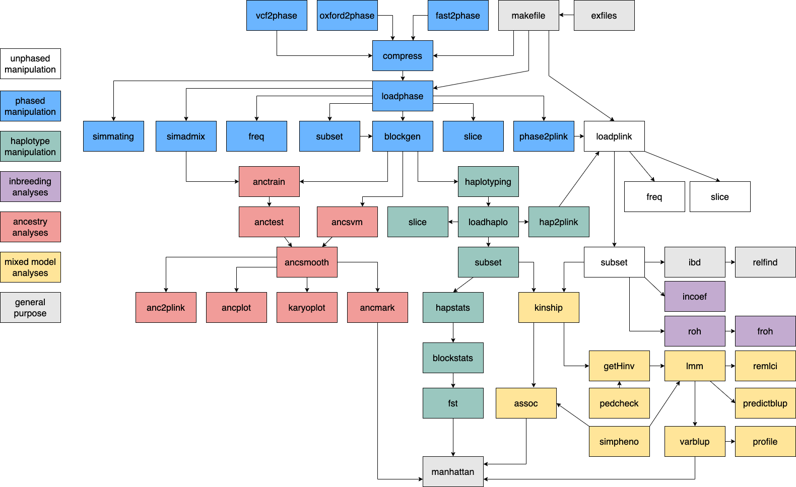

\pagebreak
\tableofcontents
\pagebreak

## Introduction

**GHap** is an acronym for **G**enome-wide **Hap**lotyping, and is pronounced **G**-**Hap**, not gap (although it is intended to fill the gap of haplotype analyses). The **GHap** R package was originally designed to call haplotypes from phased SNP data. Given user-defined haplotype blocks (HapBlock), the package identifies the different haplotype alleles (HapAllele) present in the data and scores sample haplotype allele genotypes (HapGenotype) based on copy number (i.e., 0, 1 or 2 copies). The output is conveniently formatted for existing pipelines intended for bi-allelic markers.

The package was first described in Bioinformatics by Utsunomiya et al. (2016, doi:10.1093/bioinformatics/btw356). Since the v2 release, the package provides functions for unsupervised and supervised detection of ancestry tracks. The methods implemented in these functions were described in an article published in Methods in Ecology and Evolution by Utsunomiya et al. (2020, doi:10.1111/2041-210X.13467).

In the v3 release, the source code was extensively modified for improved performance and inclusion of new functionality for both phased and unphased SNP data, including analysis of runs of homozygosity, sampling methods for virtual gamete mating, mixed model fitting and GWAS. Overall, the package is a comprehensive and versatile tool for the analysis of genomic data.

\pagebreak

## Diagram of functions
The diagram below ilustrates the overall organization of the functions within the **GHap** package. Arrows indicate analysis flow and colors encode analysis context.
```{r pressure, echo=FALSE, fig.cap="Diagram of functions within the package", fig.pos="H", out.width = '100%'}

```
\pagebreak


## Tutorial 1 - Data formats

There are three different input data formats that **GHap** recognizes: binary PLINK files (bed/bim/fam), binary phase files (phaseb/markers/samples) and binary haplo files (hapgenotypesb/hapalleles/hapsamples). These formats represent unphased, phased and haplotype calls data, respectively. Example data for the first two formats can be obtained as following:

```r
# Load GHap
library(GHap)

# Copy example data in phase format
exfiles <- ghap.makefile(dataset = "example",
                         format = "phase", verbose = TRUE)
file.copy(from = exfiles, to = "./")
 
# Copy example data in plink format
exfiles <- ghap.makefile(dataset = "example",
                         format = "plink", verbose = TRUE)
file.copy(from = exfiles, to = "./")
```

The binary haplo format results from performing haplotype calling on phased data, which is illustrated in the "Haplotyping" tutorial. The example data set was simulated using the QMSim v1.10 software (Sargolzaei & Schenkel, 2009) and contains 450 individuals genotyped for 15,000 markers. These markers were randomly distributed along 10 chromosomes of 100 Mbp each (i.e., 1,500 markers per chromosome). Two divergent lineages were created, namely 'Pure1' (n = 300) and 'Pure2' (n = 100), and gene flow between these two lineages was allowed to produce low levels of admixture. An additional set of 50 crossbred individuals was also included. By using format = 'meta', metadata including pedigree and phenotypes for the 'Pure1' population can be downloaded. The pedigree contains 700 records, spanning 5 generations. The records in the phenotypes file are unbalanced repeated measurements (1 to 5 records per individual, with an average of 3) of a trait with heritability of 0.4, repeatability of 0.2, and a major QTL located on chromosome 3.

```r
# Copy example metadata
exfiles <- ghap.makefile(dataset = "example",
                         format = "meta", verbose = TRUE)
file.copy(from = exfiles, to = "./")
```

Other example data sets are also available, which can be seen by running:

```r
# See list of example files
exlist <- ghap.exfiles()
View(exlist)
```
\pagebreak

Before the v2 release, the native **GHap** input file was composed of three files with suffix:

**.samples** = space-delimited file without header containing two mandatory columns: Population and ID. Please notice that the Population column serves solely for the purpose of grouping samples, so the user can define any arbitrary family/cluster/subgroup and use as a "population" tag. This file may further contain three additional columns, which are optional: Sire, Dam and Sex (with code 1 = M and 2 = F). Values "0" and "NA" in these additional columns are treated as missing values.

**.markers** = space-delimited file without header containing five mandatory columns: Chromosome, Marker, Position (in bp), Reference Allele (A0) and Alternative Allele (A1). Markers should be sorted by chromosome and position. Repeated positions are tolerated, but the user is warned of their presence in the data. Optionally, the user may provide a file containing an additional column with genetic positions (in cM), which has to be placed between the base pair position and the reference allele columns.

**.phase** =  space-delimited file without header containing the phased genotype matrix. The dimension of the matrix is expected to be $m$ x 2$n$, where $m$ is the number of markers and n is the number of individuals (i.e., two columns per individual, representing the two phased chromosome alleles). Alleles must be coded as 0 or 1. No missing values are allowed, since imputation is assumed to be part of the phasing procedure.

See below an example using the Human HapMap3 chromosome 2 data. Five individuals from the ASW population with phased genotypes for five markers are displayed:

```txt
======================================================================
|  .samples file  |      .markers file       |      .phase file      |
======================================================================
|  ASW NA19904    |  2 rs13383216 18228 A G  |  1 1 1 1 1 1 1 1 1 1  |
|  ASW NA20340    |  2 rs13386087 24503 G T  |  0 0 0 0 0 0 0 0 0 0  |
|  ASW NA20297    |  2 rs10179984 33092 A G  |  1 0 1 0 0 0 0 0 1 1  |
|  ASW NA20281    |  2 rs300761   60074 A G  |  0 1 0 0 1 1 0 1 0 1  |
|  ASW NA20348    |  2 rs6749571  72820 C G  |  0 0 0 0 0 0 0 1 0 0  |
======================================================================
```

This format can be obtained from Oxford HAPS/SAMPLE files with the `ghap.oxford2phase` function, from fastPHASE v1.4.0 files with the `ghap.fast2phase` function, or from VCF files with the `ghap.vcf2phase` function. Since v2 **GHap** requires the **.phase** file to be converted into a binary file with suffix **.phaseb** with the `ghap.compress` function prior to loading in R. Each allele is stored as a bit in that file. Bits for any given marker are arranged in a sequence of bytes. Since each marker requires storage of 2\*nsamples bits, the number of bytes consumed by a single marker in the output file is ceiling(2\*nsamples). If the number of alleles is not a multiple of 8, bits in the remainder of the last byte are filled with 0. All functions in **GHap** were carefully designed to decode the bytes of a marker in such a way that trailing bits are ignored if present.

\pagebreak

If the user has phased data in the VCF format for example, the non-binary phase files can be obtained as:

```r
# Copy the example VCF data
exfiles <- ghap.makefile(dataset = "example",
                         format = "vcf",
                         verbose = TRUE)
file.copy(from = exfiles, to = "./")
 
# Convert from a single genome-wide file
ghap.vcf2phase(input.files = "example",
               out.file = "example")
 
# Convert from a list of chromosome files
ghap.vcf2phase(input.files = paste0("example_chr",1:10),
               out.file = "example")
 
# Convert using separate lists for file extensions
ghap.vcf2phase(vcf.files = paste0("example_chr",1:10,".vcf"),
               sample.files = paste0("example_chr",1:10,".sample"),
               out.file = "example")
```

Similarly, Oxford HAPS/SAMPLE files can be converted to non-binary phase as:

```r
# Copy the example Oxford data
exfiles <- ghap.makefile(dataset = "example",
                         format = "oxford",
                         verbose = TRUE)
file.copy(from = exfiles, to = "./")
 
# Convert from a single genome-wide file
ghap.oxford2phase(input.files = "example",
                  out.file = "example")

# Convert from a list of chromosome files
ghap.oxford2phase(input.files = paste0("example_chr",1:10),
                  out.file = "example")
 
# Convert using separate lists for file extensions
ghap.oxford2phase(haps.files = paste0("example_chr",1:10,".haps"),
                  sample.files = paste0("example_chr",1:10,".sample"),
                  out.file = "example")
 
# A more efficient alternative for *nix system users
# Note: replace "cat" by "zcat" if files are gzipped
haps.files = paste("example_chr",1:10,".haps",sep="")
command <- "tail -n+3 example_chr1.sample | cut -d' ' -f1,2 > example.samples"
system(command)
for(i in 1:10){
  command <- paste("cat",haps.files[i],"| cut -d' ' -f1-5 >> example.markers")
  system(command)
  command <- paste("cat",haps.files[i],"| cut -d' ' -f1-5 --complement >> example.phase")
  system(command)
}
```

Once the non-binary phase data (phaseb/markers/samples) has been generated, the binary phase format can be obtained as follows: 

```r
# Compress phase data using prefix
ghap.compress(input.file = "example",
              out.file = "example")
 
# Compress phase data using file names
ghap.compress(samples.file = "example.samples",
              markers.file = "example.markers",
              phase.file = "example.phase",
              out.file = "example")
```

\pagebreak

## Tutorial 2 - Manipulating phased objects

The `ghap.loadphase()` function is responsible for loading phased chromosomes from an input file and converting them into a native **GHap.phase** object. A detailed describtion of this object can be found in the documentation of the function. To load the example data in the package we can run:

```r
# Load data using prefix
phase <- ghap.loadphase(input.file = "example")

# Load data using file names
phase <- ghap.loadphase(samples.file = "example.samples",
                        markers.file = "example.markers",
                        phaseb.file = "example.phaseb")
```

The `ghap.subset()` function can take any combination of markers and individuals and subset the **GHap.phase** object. This is achieved by setting undesired markers and individuals to **FALSE**. Inactivated individuals and markers are then ignored by all other functions taking a **GHap.phase** object as input.

For instance, we know that markers with low polymorphic information content may result in rare HapAlleles during haplotype calling. If downstream analyses do not benefit from rare HapAlleles (e.g., haplotype association), it may be advantageous to prune these markers out prior to haplotyping. The code below shows how to subset markers with a minor allele frequency of at least 5% in a specific population:

```r
# Subset individuals from population 'Pure1'
pure1 <- unique(phase$id[which(phase$pop == "Pure1")])
phase <- ghap.subset(object = phase, ids = pure1,
                     variants = phase$marker)
 
# Calculate allele frequencies for population 'Pure1'
freq <- ghap.freq(phase, type = 'maf')
 
# Subset markers with MAF > 0.05 in population 'Pure1'
mkr <- names(freq)[which(freq > 0.05)]
phase <- ghap.subset(object = phase, ids = pure1,
                     variants = mkr)
```

To undo the subsetting and restore samples and markers, one can simply run:

```r
# Reactivate all samples and markers
phase <- ghap.subset(object = phase, ids = unique(phase$id),
                     variants = phase$marker)
```

\pagebreak

It is convenient in some analyses and data exploration to be able to quickly get specific slices of the data and import them as matrices in R. For example, say one wants to import data from 5 individuals and 10 markers:

```r
# Select random individuals and markers
ind <- sample(x = unique(phase$id), size = 5)
mkr <- sample(x = phase$marker, size = 10)
 
# Generate slice of the data
ghap.slice(object = phase, ids = ind, variants = mkr)
 
# Import as unphased data
ghap.slice(object = phase, ids = ind, variants = mkr,
           unphase = TRUE)

# Return transposed matrix
ghap.slice(object = phase, ids = ind, variants = mkr,
           unphase = TRUE, transposed = TRUE)
 
# Display data as non-sparse matrix
ghap.slice(object = phase, ids = ind, variants = mkr,
           unphase = TRUE, transposed = TRUE,
           sparse = FALSE)
```

It is also possible to convert the phase object into PLINK binary files (bed/bim/fam), albeit this procedure will cause loss of phase information during conversion:

```r
# Convert from phase to plink
ghap.phase2plink(object = phase, out.file = "example")
```

\pagebreak

## Tutorial 3 - Manipulating plink objects

Manipulation of plink objects work very similar to phase objects in **GHap**. For example, a similar subsetting procedure looks like this:

```r
# Load plink data
plink <- ghap.loadplink("example")

# Subset individuals from population 'Pure1'
pure1 <- plink$id[which(plink$pop == "Pure1")]
plink <- ghap.subset(object = plink, ids = pure1,
                     variants = plink$marker)
 
# Calculate allele frequencies for population 'Pure1'
freq <- ghap.freq(plink, type = 'maf')
 
# Subset markers with MAF > 0.05 in population 'Pure1'
mkr <- names(freq)[which(freq > 0.05)]
plink <- ghap.subset(object = plink, ids = pure1,
                     variants = mkr)
```

likewise, slicing a plink object is straightforward:

```r
# Select random individuals and markers
ind <- sample(x = plink$id, size = 5)
mkr <- sample(x = plink$marker, size = 10)
 
# Generate slice of the data
ghap.slice(object = plink, ids = ind, variants = mkr)

# Return transposed matrix
ghap.slice(object = plink, ids = ind, variants = mkr,
           transposed = TRUE)
 
# Display data as non-sparse matrix
ghap.slice(object = plink, ids = ind, variants = mkr,
           transposed = TRUE, sparse = FALSE)
           
# Replace missing values with homozygous A0
ghap.slice(object = plink, ids = ind, variants = mkr,
           transposed = TRUE, sparse = FALSE,
           impute = TRUE)
```


\pagebreak

## Tutorial 4 - Haplotyping

In principle, the user can provide the coordinates of any arbitrary haplotype block (HapBlock). In **GHap**, we provide means to generate coordinates for HapBlocks based on sliding windows of markers. This strategy is particularly useful in genome-wide scans.

```r
# Generate blocks of 5 markers sliding 5 markers at a time
blocks.mkr <- ghap.blockgen(phase, windowsize = 5, slide = 5, unit = "marker")

# Generate blocks of 100 kb sliding 100 kb at a time
blocks.kb <- ghap.blockgen(phase, windowsize = 100, slide = 100, unit = "kbp")
```

By default all blocks are constrained to a minimum of two markers. This behavior can be adjusted by setting the *nsnp* argument to a different value. The extent of overlap between consecutive blocks can be controlled via the *slide* argument, depending on how fine the user wishes the genome-wide scan to be. Once HapBlocks have been defined, haplotype genotypes (HapGenotypes) can be determined:

```r
# Generate matrix of haplotype genotypes
ghap.haplotyping(object = phase, blocks = blocks.mkr,
                 outfile = "example", binary = TRUE)
```
By default all HapAlleles are included in the output. If intended, the user can exclude the minor HapAllele by setting the *drop.minor* argument to **TRUE**. Additionally, the *freq* argument allows for exclusion of HapAlleles outside of a specified frequency range. Control of memory usage and process parallelization is achieved through the arguments *batchsize* and *ncores*.

The haplotyping algorithm works as follows: Let a haplotype library (HapLibrary) be the collection of observed HapAlleles for a given HapBlock. Each HapAllele in the library is treated as a pseudo-marker, and HapGenotypes are scored as 0, 1 or 2 HapAllele copies. Take the Human HapMap3 chromosome 2 data as an example:

```txt
======================================================================
|  .samples file  |      .markers file       |      .phase file      |
======================================================================
|  ASW NA19904    |  2 rs13383216 18228 A G  |  1 1 1 1 1 1 1 1 1 1  |
|  ASW NA20340    |  2 rs13386087 24503 G T  |  0 0 0 0 0 0 0 0 0 0  |
|  ASW NA20297    |  2 rs10179984 33092 A G  |  1 0 1 0 0 0 0 0 1 1  |
|  ASW NA20281    |  2 rs300761   60074 A G  |  0 1 0 0 1 1 0 1 0 1  |
|  ASW NA20348    |  2 rs6749571  72820 C G  |  0 0 0 0 0 0 0 1 0 0  |
======================================================================
```

Let's assume the user wishes to call haplotypes for the first three markers. First, we crop the matrix at the selected markers (for the sake of clarity, we will transpose the matrix and represent subjects in rows and markers in columns):

\pagebreak

```txt
POP ID      rs13383216 rs13386087 rs10179984
ASW NA19904 1          0          1
ASW NA19904 1          0          0
ASW NA20340 1          0          1
ASW NA20340 1          0          0
ASW NA20297 1          0          0
ASW NA20297 1          0          0
ASW NA20281 1          0          0
ASW NA20281 1          0          0
ASW NA20348 1          0          1
ASW NA20348 1          0          1
```

The HapLibrary is created based on the unique HapAlleles:

```txt
HapAllele1: 101 (GGG)
HapAllele2: 100 (GGA)
```

Then, for each HapAllele, individual HapGenotypes are scored based on the number of copies:

```txt
POP ID      GGG        GGA
ASW NA19904 1          1
ASW NA20340 1          1
ASW NA20297 0          2
ASW NA20281 0          2
ASW NA20348 2          0
```

The procedure is then repeated for each HapBlock. The haplotyping function generates the following files:

**.hapsamples**: space-delimited file without header containing two columns: Population and Individual ID.

**.hapalleles**: space-delimited file without header containing five columns: Block Name, Chromosome, Start and End Position (in bp), and HapAllele.

**.hapgenotypes**: if binary = FALSE, a space-delimited file without header containing the HapGenotype matrix (coded as 0, 1 or 2 copies of the HapAllele). The dimension of the matrix is $m$ x $n$, where $m$ is the number of HapAlleles and n is the number of individuals.

**.hapgenotypesb**: if binary = TRUE (default), the same matrix as described above compressed into bits. For seamless compatibility with softwares that use PLINK binary files (bed/bim/fam), the compression is performed using the SNP-major bed format.

The example below was extracted from the first two HapBlocks for the Human HapMap3 data, using a random draw of 3,000 markers:

```txt
==============================================================================================
|  .hapsamples file  |            .hapalleles file            |      .hapgenotypes file      |
==============================================================================================
|     ASW NA19904    |  CHR2_B4 2 1009753 2462617 CCAATGTGGG  |           0 0 0 0 0          |
|     ASW NA20340    |  CHR2_B6 2 2511429 3071611 CCACACCAAT  |           0 0 0 0 0          |
|     ASW NA20297    |  CHR2_B6 2 2511429 3071611 CCACACCGAT  |           0 0 0 0 0          |
|     ASW NA20281    |  CHR2_B6 2 2511429 3071611 CTACACCAAT  |           0 0 1 0 0          |
|     ASW NA20348    |  CHR2_B6 2 2511429 3071611 CTACACCGAT  |           0 0 1 0 0          |
==============================================================================================
```

\pagebreak

## Tutorial 5 - Manipulating haplo objects

After HapAlleles have been scored, the data can be loaded into R using the `ghap.loadhaplo()` function:

```r
# Load haplotype genotypes using prefix
haplo <- ghap.loadhaplo("example")
 
# Load haplotype genotypes using file names
haplo <- ghap.loadhaplo(hapsamples.file = "example.hapsamples",
                        hapalleles.file = "example.hapalleles",
                        hapgenotypesb.file = "example.hapgenotypesb")
```

Similar to the phase and plink objects, the user can also subset haplo objects. For instance:

```r
# Randomly select 50 individuals
ind <- sample(x = haplo$id, size = 50, replace = FALSE)

# Subset data
haplo <- ghap.subset(object = haplo, ids = ind,
                     variants = which(haplo$allele.in),
                     index = TRUE)

# Restore selection of the entire data
haplo <- ghap.subset(object = haplo,
                     ids = 1:haplo$nsamples,
                     variants = 1:haplo$nalleles,
                     index = TRUE)
```

To obtain a slice of specific individuals and HapAlleles, one can run:

```r
# Generate slice of the data
ghap.slice(object = phase, ids = 1:5,
           variants = 1:10, index = TRUE)
           
# Return transposed matrix
ghap.slice(object = phase, ids = 1:5,
           variants = 1:10, index = TRUE
           transposed = TRUE)
```

To convert the haplo object into a PLINK binary file, use:

```r
# Convert to plink
ghap.hap2plink(haplo, outfile = "example")
```

\pagebreak

## Tutorial 6 - Haplotype statistics

For each HapAllele, the `ghap.hapstats` function retrieves absolute and relative frequencies, expected and observed number of homozygotes, and different tests for deficit of homozygotes in comparison to Hardy-Weinberg Equilibrium (HWE) expectations.

```r
# Subset
ids <- which(haplo$pop == "Pure1")
haplo <- ghap.subset(haplo, ids = ids,
                     variants = which(haplo$allele.in),
                     index = TRUE)

# Compute haplotype statistics
hapstats <- ghap.hapstats(haplo)
```

The function also assigns a *TYPE* category to each HapAllele:\newline

"ABSENT" = the frequency of the allele is 0;

"SINGLETON" = unique haplotype of its block with frequency 1 (i.e., monomorphic block);

"MINOR" = the least frequent haplotype of its block (in the case of ties, only the first haplotype is marked);

"MAJOR" = the most frequent hapotype of its block (ties are also resolved by marking the first haplotype);

"REGULAR" = the haplotype does not fall into any of the previous categories.\newline

Categories "SINGLETON", "MINOR" and "MAJOR" only apply to blocks where frequencies sum to 1. The `ghap.blockstats` function summarizes HapAllele statistics per block and retrieves the expected heterozygosity and the number of alleles per HapBlock. For instance:

```r
# Compute block statistics
blockstats <- ghap.blockstats(hapstats)
```

Notice that calculation of expected heterozygosity will not be reliable when HapAlleles are prunned out by frequency during haplotyping. Therefore, the function will return NA for blocks where HapAllele frequencies do not sum to unity. Also, when the dataset contains multiple populations and the statistics are computed in the overall data, the expected heterozygosity and the number of alleles will be very high.

The tests for deficit of homozygotes in comparison to HWE are computed as follows. Relative to HapAllele $i$, let $p_i$, $h_i$ and $n$ represent the relative frequency, the number of homozygotes, and the number of subjects, respectively. Also, let $S_i$ be some test statistic or score for the HapAllele, representing the goodness-of-fit of $h_i$ to HWE expectations. The `ghap.hapstats()` function computes three candidate methods for $S_i$:

*Method 1*.  The number of homozygotes for haplotype $i$ is expected to be $E[h_i] = np_i^2$ under HWE. Provided we observed $O[h_i]$ homozygotes, deviations from HWE expectations can be expressed in terms of the expected-to-observed ratio:

$$S_i = \dfrac{E[h_i] + \alpha_1}{O[h_i] + \alpha_2}$$

where $\alpha_1$ and $\alpha_2$ are shrinkage parameters. The purpose of the shrinkage parameters is to regularize the scores towards a ratio of $\frac{\alpha_1}{\alpha_2}$, being particularly useful in cases where the number of observed homozygotes is close to zero. As the null ratio value is 1 (i.e., expected and observed counts are equal), a reasonable choice of shrinkage parameters is $\alpha_1 = \alpha_2 = 1$ (the default in **GHap**), which in practice introduces a bias equivalent to that of one additional expected and one additional observed homozygote. For a more detailed review on shrinkage expected-to-observed (or observed-to-expected) ratio, see Norén et al. (2013).

*Method 2*.	Under the null hypothesis of HWE, $h_i \sim Binomial(n,p_i^2)$, with $E[h_i] = np_i^2$ and $VAR[h_i] = np_i^2(1-p_i^2)$. Therefore, the probability of observing $h_i$ or less homozygotes given the haplotype is in HWE is:

$$Pr(X \leq h_i) = \sum\limits_{j \leq h_i}^{} \dbinom{n}{j} p_i^{2j} (1-p_i^2)^{n-j}$$

where $X$ is a random draw from the Binomial distribution.
	
*Method 3*.	Provided $n$ is large, $h_i \sim Poisson(\lambda_i)$, where $\lambda_i = E[h_i] = VAR[h_i] = np_i^2$. This leads to probability:

$$Pr(X \leq h_i) = e^{-\lambda_i} \sum\limits_{j \leq h_i}^{} \frac{\lambda_i^j}{j!}$$

Note that the variance in the Binomial model is smaller than in the Poisson model, which in practice results in more conservative probabilities in the latter case. **GHap** also provides means for the analysis of haplotype divergence. For example, to perform a $F_{ST}$ analysis contrasting the 'Pure1' and 'Pure2' populations, one can run:

```r
# Compute block statistics for population 1
ids <- which(haplo$pop == "Pure1")
haplo <- ghap.subset(haplo, ids = ids,
                     variants = which(haplo$allele.in),
                     index = TRUE)
hapstats1 <- ghap.hapstats(haplo)
blockstats1 <- ghap.blockstats(hapstats1)

# Compute block statistics for population 2
ids <- which(haplo$pop == "Pure2")
haplo <- ghap.subset(haplo, ids = ids,
                     variants = which(haplo$allele.in),
                     index = TRUE)
hapstats2 <- ghap.hapstats(haplo)
blockstats2 <- ghap.blockstats(hapstats2)

# Compute block statistics for combined populations
ids <- which(haplo$pop %in% c("Pure1","Pure2"))
haplo <- ghap.subset(haplo, ids = ids,
                     variants = which(haplo$allele.in),
                     index = TRUE)
hapstats12 <- ghap.hapstats(haplo)
blockstats12 <- ghap.blockstats(hapstats12)

# Compute FST
fst <- ghap.fst(blockstats1, blockstats2, blockstats12)
ghap.manhattan(data = fst, chr = "CHR", bp = "BP1",
               y = "FST", type = "h")
```

Ideally, similar to the case of HapAllele and HapBlock statistics, the $F_{ST}$ analysis should be carried out on the full set of HapAlleles, rather than a frequency-prunned subset. Haplotype-based $F_{ST}$ calculations are based on the multi-allelic formula (Nei, 1973):

$$F_{ST} = (H_T - H_S)/H_T$$

where $H_T$ is the total gene diversity (i.e., expected heterozygosity in the population) and $H_S$ is the sub-population gene diversity (i.e., the average expected heterozygosity in the sub-populations).

\pagebreak

## Tutorial 7 - Ancestry analysis

The package provides three methods for the prediction of haplotype ancestry:

**GHap Unsupervised**. This method does not require a reference sample. It is based on a combination of K-means and heuristics, and is divided into three steps. In the first one, a random sample of seeding markers (default value of nmarkers = 5000) is used to group all 2\*nsamples haplotypes in a user-specified number of clusters (default value of K = 2). Then, for each interrogated block, prototype alleles (i.e., centroids) are built for every cluster using the mean of observed haplotypes initially assigned to that cluster. Finally, each tested haplotype is assigned to the nearest centroid (i.e., with the smallest Euclidean distance). K-means is internally ran through the `kmeans` function in the **stats** package.

```r
# Unsupervised GHap analysis
prototypes1 <- ghap.anctrain(object = phase, K = 2)
hapadmix1 <- ghap.anctest(object = phase,
                          prototypes = prototypes1,
                          test = unique(phase$id))
```

**GHap Supervised**. This method is similar to the 'unsupervised' method, only replacing the K-means clutering step by user-defined clusters of reference samples.

```r
# Supervised GHap analysis
train <- unique(phase$id[which(phase$pop != "Cross")])
prototypes2 <- ghap.anctrain(object = phase, train = train,
                             method = "supervised")
hapadmix2 <- ghap.anctest(object = phase,
                          prototypes = prototypes2,
                          test = unique(phase$id))
```

**Support Vector Machines (SVM)**. This method performs predictions using Support Vector Machines (SVM) together with a Gaussian Radial Basis Function (RBF) kernel. The user is required to specify a reference sample of individuals with known ancestry labels. The reference sample is then used to train the SVM model, which is parameterized by the C constant of the regularization term in the Lagrange formulation (default cost = 1) and the gamma parameter (default gamma = 1/blocksize) of the RBF kernel. Fitting of SVM is performed internally by the `svm` function from the **e1071** package. Test samples have the ancestries of their HapAlleles predicted using the fitted SVM.

```r
# Supervised ancestry using SVM
hapadmix3 <- ghap.ancsvm(object = phase, train = train)
```

In all three methods, the classifiers assume exactly one ancestry per HapBlock, such that segments encompassing breakpoints are miss-classified as pertaining to a single ancestral origin, as opposed to a recombinant mixture of hybrid ancestries. When any of the three methods is ran with overlapping HapBlocks, the user should use the `ghap.ancsmooth()` function to convert HapAllele classifications into ancestry tracks. In this case, the smoothing function interrogates the ancestry of each overlapped segment by majority voting of all blocks containing it. After the ancestry of all segments have been resolved, contiguous sites sharing the same classification are converted into runs or segments of ancestry, which comprise the final output of an ancestry analysis.

\pagebreak

```r
# Generate ancestry tracks
anctracks1 <- ghap.ancsmooth(object = phase, admix = hapadmix1)
anctracks2 <- ghap.ancsmooth(object = phase, admix = hapadmix2)
anctracks3 <- ghap.ancsmooth(object = phase, admix = hapadmix3)

# Compare ancestry proportions results
ghap.ancplot(ancsmooth = anctracks1)
ghap.ancplot(ancsmooth = anctracks2)
ghap.ancplot(ancsmooth = anctracks3)

# Compare ancestry tracks for one individual
ghap.karyoplot(ancsmooth = anctracks1, ids = phase$id[66])
ghap.karyoplot(ancsmooth = anctracks2, ids = phase$id[66])
ghap.karyoplot(ancsmooth = anctracks3, ids = phase$id[66])
```

It is also possible to summarize average ancestries per marker for a given group of individuals using the `ghap.ancmark` function. This is useful to screen chromosomes for loci that substantially deviate from the average ancestry across the genome.

```r
# Compute SNP ancestries
pure1 <- phase$id[which(phase$pop == "Pure1")]
ancmark <- ghap.ancmark(phase, ancsmooth = anctracks2, ids = pure1)

# Investigate introgression of Pure2 into Pure1
ghap.manhattan(data = ancmark, chr = "CHR", bp = "BP", y = "Pure2", type="h")
```

Another useful feature is the possibility of exporting ancestry track data to PLINK for admixture mapping. The `ghap.anc2plink` function allows the user to count the number of alleles of a given ancestry at each marker and export a genome-wide matrix in either plain text or PLINK binary format (Purcell et al., 2007; Chang et al., 2015). In the latter case, bed/bim/fam files are generated, where ancestry counts 0, 1 and 2 are recoded as NN, NH and HH genotypes (N = NULL and H = haplotype allele), as if ancestry statuses were bi-alelic markers. This coding scheme is acceptable for any given analysis relying on genotype counts, as long as the user specifies that the analysis should be done using character H as the reference for counts.

```r
# Export crossbred data to PLINK binary
cross <- unique(phase$id[which(phase$pop == "Cross")])
phase <- ghap.subset(object = phase,
                    ids = cross,
                    variants = phase$marker)
ghap.anc2plink(object = phase, ancsmooth = anctracks2,
               ancestry = "K1", outfile = "cross_K1")
```

\pagebreak

## Tutorial 8 - Identity-by-descent analysis

The `ghap.ibd()` function implements PLINK's method-of-moments for identity-by-descent (IBD) estimation. Although not as efficient as PLINK's implementation, our function allows the user to restrict calculations to specific individual pairs, as well as ground all computations on allele frequencies obtained from a reference population. This is useful for routine pedigree confirmation, since a smaller set of indviduals and comparisons are typically targeted in these situations. The original `--genome` flag in PLINK not only performs all possible comparisons given a set of individuals, but also estimates allele frequencies on-the-fly, which may be unreliable if the number of individuals is small. We still recommend using PLINK for large problems, such as all pairwise comparisons from thousands of individuals, because it is more efficient. Nevertheless, we offer a more convenient alternative for the validation of smaller pedigrees in routine analyses where a look up table of allele frequencies is available and maintained from a large reference population. Below we present an example of an IBD analysis targeting one individuals:

```r
# Subset individuals from the pure1 population
pure1 <- plink$id[which(plink$pop == "Pure1")]
plink <- ghap.subset(object = plink, ids = pure1, variants = plink$marker)

# Subset markers with MAF > 0.05
freq <- ghap.freq(plink)
mkr <- names(freq)[which(freq > 0.05)]
plink <- ghap.subset(object = plink, ids = pure1, variants = mkr)

# Compute A1 allele frequencies
p <- ghap.freq(plink, type = "A1")

# Compute IBD statistics for individual 1
pairlist <- data.frame(ID1 = pure1[1], ID2 = pure1[-1])
ibd <- ghap.ibd(object = plink, pairlist = pairlist, freq = p,
                refsize = length(pure1))
```

The resulting dataframe contains the following columns:\newline

POP1 = Population of individual 1

ID1 = Name of individual 1

POP2 = Population of individual 2

ID2 = Name of individual 2

IBS0 = Variant sites where ID1 and ID2 share no identical alleles

IBS1 = Variant sites where ID1 and ID2 share 1 identical allele

IBS2 = Variant sites where ID1 and ID2 share 2 identical alleles

PERC = IBS2/(IBS0+IBS1+IBS2) [proportion of identical genotypes]

DST = (IBS2 + 0.5*IBS1)/(IBS0+IBS1+IBS2) [proportion of shared alleles]

Z0 = Proportion of the genome where ID1 and ID2 share no alleles IBD

Z1 = Proportion of the genome where ID1 and ID2 share 1 allele IBD

Z2 = Proportion of the genome where ID1 and ID2 share 2 alleles IBD

PI_HAT = Z2 + 0.5*Z1 (proportion of IBD alleles shared between ID1 and ID2)

\pagebreak

Since some relationship types will leave distinctive patterns in these values, we implemented a composite likelihood score to predict relationships in the `ghap.relfind()` function:

```r
# Predict relationships for individual 1
rel <- ghap.relfind(ibdpairs = ibd)
table(rel$REL)
```

Columns Z0, Z1 and Z2 are the IBD sharing estimates representing the proportions of the genome where the two individuals being compared share exactly 0, 1 and 2 alleles identically by descent, respectively, whereas PI_HAT is the proportion of the genome shared identically by descent. Therefore, given a relationship type, the expectations for these estimates are provided below:

```txt
======================================================================================
|  code  |                relationship type         | PI_HAT |  Z0   |  Z1   |  Z2   |
======================================================================================
|   -1   |  Duplicates/Monozygotic twins            | 1.0000 | 0.000 | 0.000 | 1.000 |
|    0   |  Parent-offspring*                       | 0.7500 | 0.000 | 0.500 | 0.500 |
|    1   |  Parent-offspring                        | 0.5000 | 0.000 | 1.000 | 0.000 |
|  2.1   |  Full-siblings                           | 0.5000 | 0.250 | 0.500 | 0.250 |
|  2.2   |  Full-siblings*                          | 0.5000 | 0.500 | 0.000 | 0.500 |
|  3.1   |  Half-sibs/Grandparent(child)/Avuncular* | 0.3750 | 0.375 | 0.500 | 0.125 |
|  3.2   |  Half-sibs/Grandparent(child)/Avuncular  | 0.2500 | 0.500 | 0.500 | 0.000 |
|  3.3   |  Cousin or Half-avuncular                | 0.1250 | 0.750 | 0.250 | 0.000 |
|  3.4   |  Half-cousin                             | 0.0625 | 0.875 | 0.125 | 0.000 |
|    4   |  Unrelated                               | 0.0000 | 1.000 | 0.000 | 0.000 |
======================================================================================
```

For each relationship type, the likelihood of each of the four IBD values (Z0, Z1, Z2 and PI_HAT) is computed from a beta distribution with parameters $a$ = $\mu\nu$ and $b$ = $(1-\mu)\nu$, where $\mu$ is the expected value according to the relationship type and $\nu$ is a hyperparameter controlling the variance around the expected value (default $\nu$ = 50). The composite likelihood is computed by summing the log-likelihoods for the four IBD values. The prediction is made by adopting the relationship type with the highest composite likelihood score.

This classification strategy was inspired by the method reported by Staples et al. (2014), albeit it is a different method. While Staples and collaborators infer relationships through Gaussian Kernel Density Estimation using only Z0 and Z1 values, our strategy uses the composite score formed by the sum of beta log-likelihoods for all IBD values.

\pagebreak

## Tutorial 9 - Inbreeding analysis

The `ghap.inbcoef()` function provides four different measures of genomic inbreeding:

```r
# Subset individuals from the pure1 population
pure1 <- plink$id[which(plink$pop == "Pure1")]
plink <- ghap.subset(object = plink, ids = pure1, variants = plink$marker)

# Subset markers with MAF > 0.05
freq <- ghap.freq(plink)
mkr <- names(freq)[which(freq > 0.05)]
plink <- ghap.subset(object = plink, ids = pure1, variants = mkr)

# Compute A1 allele frequencies
p <- ghap.freq(plink, type = "A1")

# Compute inbreeding coefficients
ibc <- ghap.inbcoef(object = plink, freq = p)
```

The inbreeding measures are computed as $k + s[\sum_{i=1}^{n} f(i)]/d$, where $k$ is a constant, $s$ is a sign shifting scalar, $f(i)$ is a per-variant function and $d$ is a scaling denominator. Four different measures of inbreeding are currently available:


**Type = 1 (based on genomic relationship)**

$k = -1$

$s = 1$

$f(i) = (m - 2p)^2/2p(1-p)$

$d = n$


**Type = 2 (excess homozygosity)**

$k = 1$

$s = -1$

$f(i) = m(2-m)/2p(1-p)$

$d = n$


**Type = 3 (correlation between uniting gametes)**

$k = 0$

$s = 1$

$f(i) = [m^2 - (1+2p) + 2p^2]/2p(1-p)$

$d = n$


**Type = 4 (method-of-moments)**

$k = 1$

$s = -1$

$f(i) = het(m)$

$d = \sum 2p(1-p)$


In the expressions above, $m$ is the genotype coded as 0, 1 or 2 copies of A1, $p$ is the frequency of A1, $n$ is the number of variants (only non-monomorphic ones are considered), and $het(m)$ is a function that retrieves 1 if the genotype is 1 and 0 otherwise (i.e., indicator function of heterozygous genotypes).

\pagebreak

The package also provides functions for the analysis of inbreeding through Runs Of Homozygosity (ROHs). The main method is based on a Hidden Markov Model (HMM) that takes genotyping error and recombination into account while detecting ROHs. The model is similar to the ones described by Narasimhan et al (2016) and Druet & Gautier (2017), differing slightly in the definition of transition and emission probabilities. In **GHap**, emission probabilities are assumed:

$$Pr(m_{i} \in \{0,2\} | S_{i} = H) = \epsilon$$
$$Pr(m_{i} = 1 | S_{i} = H) = 1-\epsilon$$
$$Pr(m_{i} \in \{0,2\} | S_{i} = N) = p_{i}^2 + (1-p_{i})^2$$
$$Pr(m_{i} = 1 | S_{i} = N) = 2p_{i}(1-p_{i})$$

where, relative to variant $i$, $m_{i}$ is the genotype, $S_{i}$ is the hidden state taking values $H$ for ROH and $N$ otherwise, $p_{i}$ is the frequency of the counted allele and $\epsilon$ is the genotyping error. The default in the package is to assume $\epsilon = 0.0025$, which is a good proxy for the average genotyping error rate in SNP arrays. The transition probabilities are defined as:

$$Pr(S_{i+1} = H | S_{i} = H) = e^{-2d} + (1-e^{-2d})f$$
$$Pr(S_{i+1} = N | S_{i} = H) = (1-e^{-2d})(1-f)$$
$$Pr(S_{i+1} = N | S_{i} = N) = e^{-2d} + (1-e^{-2d})(1-f)$$
$$Pr(S_{i+1} = H | S_{i} = N) = (1-e^{-2d})(1-f)$$

where $d$ is the genetic distance in Morgans between markers $i$ and $i+1$, $e$ is Euler's number, and $f$ is the proportion of the genome covered by ROH. Starting values for $f$ can be obtained in **GHap** by using the 'naive' method, where ROH are detected simply by searching for strecthes of homozygous genotypes. The 'naive' method is only recommended as a first pass to obtain $f$ for the HMM method. If the user does not provide a genetic map, 1 cM = 1 Mbp is assumed. The HMM is fitted using the Viterbi algorithm.

```r
# Load plink data
plink <- ghap.loadplink("example")

# Subset pure1 population
pure1 <- plink$id[which(plink$pop == "Pure1")]
plink <- ghap.subset(object = plink, ids = pure1, variants = plink$marker)

# ROH via the 'naive' method
roh1 <- ghap.roh(plink, method = "naive")
froh1 <- ghap.froh(plink, roh1)

# ROH via the 'hmm' method
freq <- ghap.freq(plink, type = 'A1')
inbcoef <- froh1$FROH1; names(inbcoef) <- froh1$ID
roh2 <- ghap.roh(plink, method = "hmm", freq = freq,
                inbcoef = inbcoef)
froh2 <- ghap.froh(plink, roh2)
```

\pagebreak

Another possibility for starting values of $f$ is to use the estimator 'Fhat3' (correlation between uniting gametes) from the `ghap.inbcoef()` function.

```r
# 'hmm' method using Fhat3 as starting values
inbcoef <- ibc$Fhat3; names(inbcoef) <- ibc$ID
inbcoef[which(inbcoef < 0)] <- 0.01
roh3 <- ghap.roh(plink, method = "hmm", freq = freq,
                 inbcoef = inbcoef)
froh3 <- ghap.froh(plink, roh3)
```

\pagebreak

## Tutorial 10 - Pedigree analysis

A series of summary statistics are available for pedigree data through the `ghap.pedcheck()` function, which are useful for integrity checks. The input pedigree must contain columns id, sire and dam.

```r
# Copy metadata in the current working directory
exfiles <- ghap.makefile(dataset = "example",
                         format = "meta",
                         verbose = TRUE)
file.copy(from = exfiles, to = "./")

# Load pedigree data
ped <- read.table(file = "example.pedigree", header=T)

# Descriptive statistics for the pedigree
pedstat <- ghap.pedcheck(ped[,-1])
print(pedstat$stats)
```

Optionally, the user can set the argument 'depth.n.f = TRUE' to compute pedigree-based inbreeding coefficients (with the assistance of the **pedigreemm** package), as well as equivalent complete generations (ECG).

```r
# Retrieve inbreeding and pedigree depth
pedstat <- ghap.pedcheck(ped[,-1], depth.n.f = TRUE)
print(pedstat$ped)
hist(pedstat$ped$f)
hist(pedstat$ped$ecg)
```

ECG represents the pedigree depth for a given individual, and is calculated as $\sum_{i=1}^{N} (1/2)^{G_{i}}$, where $N$ is the number of observed ancestors and $G_{i}$ is the number of generations separating the individual from its ancestor $i$.

\pagebreak

## Tutorial 11 - Relationship matrix

A series of relationship matrices are available from the `ghap.kinship()` function. Let $\mathbf{M}$ be the $n$ x $m$ matrix of genotypes, where $n$ is the number of individuals and $m$ is the number of variants (i.e, markers or HapAlleles). Prior to computation, genotypes in matrix $\mathbf{M}$ are transformed according to the desired relationship type. After that transformation, the relationship matrix is computed as:

$$\mathbf{K} = q^{-1}\mathbf{MDM}^{T}$$

where $\mathbf{D} = diag(d_j)$, $d_j$ is the weight of variant $j$ (default $d_j = 1$), and $q$ is a scaling factor. The argument 'type' controls the genotype transformation and the scaling factor, and includes the following option:\newline

**Type = 1 (General additive 1)**

Genotype transformation: $\mathbf{m}_j - E[\mathbf{m}_j]$

Scaling factor: $tr(\mathbf{MDM}^{T})^{-1}n$\newline


**Type = 2 (General additive 2)**

Genotype transformation: $(\mathbf{m}_j - E[\mathbf{m}_j])/SD[\mathbf{m}_j]$

Scaling factor: $m$\newline

**Type = 3 (VanRaden, 2008)**

Genotype transformation: $\mathbf{m}_j - 2p_j$

Scaling factor: $2\sum_{j=1}^{m}p_j(1-p_j)$\newline

**Type = 4 (GCTA)**

Genotype transformation: $(\mathbf{m}_j - 2p_j)/\sqrt{2p_j(1-p_j)}$

Scaling factor: $m$\newline

**Type = 5 (Dominance 1)**

Genotype transformation:

$\begin{cases} -2p_j^2, & \text{if genotype}\ 0 \\ 2p_j(1-p_j), & \text{if genotype}\ 1\\ -2(1-p_j)^2, & \text{if genotype}\ 2 \end{cases}$

Scaling factor: $4\sum_{j=1}^{m}p_j^2(1-p_j)^2$\newline

**Type = 6 (Dominance 2)**

Genotype transformation:

$\begin{cases} -2p_j^2, & \text{if genotype}\ 0 \\ 2p_j(1-p_j), & \text{if genotype}\ 1\\ -2(1-p_j)^2, & \text{if genotype}\ 2 \end{cases}$

Scaling factor: $tr(\mathbf{MDM}^{T})^{-1}n$.

\pagebreak

```r
# Load plink data
plink <- ghap.loadplink("example")

# Load phenotype data
df <- read.table(file = "example.phenotypes", header=T)

# Subset pure1 population
pure1 <- plink$id[which(plink$pop == "Pure1")]
plink <- ghap.subset(object = plink, ids = pure1, variants = plink$marker)

# Compute different types of relationship matrices
K1 <- ghap.kinship(plink, type = 1) # General additive 1
K2 <- ghap.kinship(plink, type = 2) # General additive 2
K3 <- ghap.kinship(plink, type = 3) # VanRaden 2008
K4 <- ghap.kinship(plink, type = 4) # GCTA GRM
K5 <- ghap.kinship(plink, type = 5) # Dominance 1
K6 <- ghap.kinship(plink, type = 6) # Dominance 2
```

\pagebreak

## Tutorial 12 - Linear mixed model analysis

**GHap** implements linear mixed model analysis in the `ghap.lmm()` function. The formula describing the model has a synthax that is consistent with **lme4**. The response is declared first, followed by the '~' operator. Predictors are then separated by '+' operators. Currently only random intercepts are supported, which are distinguished from fixed effects by the notation '(1|x)'. Covariance matrices for each random effect can be passed to the 'covmat' argument. The example code below shows how to fit a GBLUP model to the data:

```r
# Load plink data
plink <- ghap.loadplink("example")

# Load phenotype and pedigree data
df <- read.table(file = "example.phenotypes", header=T)

# Subset individuals from the pure1 population
pure1 <- plink$id[which(plink$pop == "Pure1")]
plink <- ghap.subset(object = plink, ids = pure1, variants = plink$marker)

# Subset markers with MAF > 0.05
freq <- ghap.freq(plink)
mkr <- names(freq)[which(freq > 0.05)]
plink <- ghap.subset(object = plink, ids = pure1, variants = mkr)

# Compute genomic relationship matrix
# Induce sparsity to help with matrix inversion
K <- ghap.kinship(plink, sparsity = 0.01)

# Fit mixed model with variance components estimation
df$rep <- df$id
model1 <- ghap.lmm(formula = pheno ~ 1 + (1|id) + (1|rep),
                   data = df,
                   covmat = list(id = K, rep = NULL))
```

In the example above, the mixed model was fitted to a data set containing unbalanced repeated measurements (1 to 5 records per individual, with an average of 3). Only an intercept was included as fixed effect, and random effects included a genetic effect (id, with covariance K) and a permanent enviromental effect (rep, with covariance I). Variance components were estimated using a combination of a number of starting EM-REML iterations (default = 10) and AI-REML until convergance (default = 1e-12). Fixed and random effects were obtained by solving mixed model equations with the pre-conditioned gradient (PCG) algorithm. If variance components are known, the user can skip REML iterations as follows:

```r
# Fit mixed model with fixed variance components
model2 <- ghap.lmm(formula = pheno ~ 1 + (1|id) + (1|rep),
                   data = df,
                   covmat = list(id = K, rep = NULL),
                   vcp.initial = list(id = 0.4, rep = 0.2, Residual = 0.4),
                   vcp.estimate = F)
```

The returned object is a rich list containing estimates and standard errors of variance components and fixed and random effects, and fitted values and residuals conditioned on different sets of effects (only fixed, only random or all effects). Additional outputs that can be optionally requested by the user via the 'extras' argument include the phenotypic (co)variance matrix ("V") and the inverse of the coefficient matrix ("LHSi"). The package can also be used to fit single-step GBLUP models as shown next:

```r
# Load plink data
plink <- ghap.loadplink("example")

# Load phenotype and pedigree data
df <- read.table(file = "example.phenotypes", header=T)
ped <- read.table(file = "example.pedigree", header=T)

# This analysis emulates a scenario of
# 100 individuals with genotypes and phenotypes
# 200 individuals with only phenotypes
# 400 individuals from pedigree with no data

# Subset 100 individuals from the pure1 population
pure1 <- plink$id[which(plink$pop == "Pure1")]
pure1 <- sample(x = pure1, size = 100)
plink <- ghap.subset(object = plink, ids = pure1, variants = plink$marker)

# Subset markers with MAF > 0.05
freq <- ghap.freq(plink)
mkr <- names(freq)[which(freq > 0.05)]
plink <- ghap.subset(object = plink, ids = pure1, variants = mkr)

# Compute genomic relationship matrix
# Induce sparsity to help with matrix inversion
K <- ghap.kinship(plink, sparsity = 0.01)

# Exclude pedigree records with missing sire
ped <- ped[which(is.na(ped$sire) == FALSE),]

# Make inverse of blended pedigree/genomic matrix
ids <- unique(c(ped$id, ped$sire, ped$dam, colnames(K)))
Hinv <- ghap.getHinv(K = K, ped = ped[,-1], include = ids)

# Run single-step GBLUP
df$rep <- df$id
model3 <- ghap.lmm(formula = pheno ~ 1 + (1|id) + (1|rep),
                   data = df,
                   covmat = list(id = Hinv, rep = NULL),
                   invcov = TRUE)
```

If variance components are estimated from the data, standard errors and confidence intervals of any arbitrary function of variance components can be approximated using the sampling-based method implemented in the `ghap.remlci()` function. For example, if one wishes to estimate standard errors and confidence intervals for the heritability, the follow code can be used:

```r
# Compute confidence interval for heritability
h2 <- model1$vcp$Estimate[1]/sum(model1$vcp$Estimate)
h2ci <- ghap.remlci(fun = function(x){x[1]/sum(x)},
                    vcp = model1$vcp, ai = model1$AI)
print(h2)
print(h2ci)
```

\pagebreak

From a fitted model, it is also possible to predict random effects of both reference and test individuals. There are two methods available for that purpose. The first applies the projection:

$$\hat{\mathbf{u}}_{\text{test}} = \mathbf{K}_{\text{test,ref}}\mathbf{K}_{\text{ref,ref}}^{-1}\hat{\mathbf{u}}_{\text{ref}}$$

Accuracies are obtained as:

$$\hat{r}_{test} = \sqrt{\frac{\text{Diag}(\text{VAR}[\hat{\mathbf{u}}_{\text{test}}])}{\text{Diag}(\text{VAR}[\mathbf{u}_{\text{test}}])}}$$
where:\newline

$\text{VAR}[\mathbf{u}_{\text{test}}] = \hat{\sigma}_{u}^2\mathbf{K}_\text{test,test}$\newline\newline
$\text{VAR}[\hat{\mathbf{u}}_{\text{test}}] = \mathbf{K}_{\text{test,ref}}\mathbf{K}_{\text{ref,ref}}^{-1}[\hat{\sigma}_{u}^2\mathbf{K}_{\text{ref,ref}} - \mathbf{C}_{22}]\mathbf{K}_{\text{ref,ref}}^{-1}\mathbf{K}_{\text{ref,test}}$\newline

The example below illustrates how to perform that projection in **GHap**:

```r
# Define reference and test samples
set.seed(12345)
pure1 <- plink$id[which(plink$pop == "Pure1")]
test <- sample(x = pure1, size = 10)
ref <- pure1[which(pure1 %in% test == FALSE)]
plink <- ghap.subset(object = plink, ids = ref, variants = plink$marker)

# Subset markers with MAF > 0.05 in the reference
freq <- ghap.freq(plink)
mkr <- names(freq)[which(freq > 0.05)]
plink <- ghap.subset(object = plink, ids = pure1, variants = mkr)

# Fit mixed model using reference
df$rep <- df$id
model4 <- ghap.lmm(formula = pheno ~ 1 + (1|id) + (1|rep),
                   data = df[which(df$id %in% ref),],
                   covmat = list(id = K[ref,ref], rep = NULL),
                   extras = "LHSi")
refblup <- model4$random$id$Estimate
names(refblup) <- rownames(model4$random$id)

# Predict blup of test
blup <- ghap.predictblup(refblup, vcp = model4$vcp$Estimate[1],
                         covmat = as.matrix(K),
                         errormat = model4$extras$LHSi,
                         errorname = "id")

# Compare predictions
cor(blup[test,"Estimate"], model1$random$id[test,"Estimate"])
```

\pagebreak

Another possibility to project breeding values of test samples is to convert random effects of individuals into random effects of variants using:

$$\mathbf{\hat{\alpha}} = q^{-1}\mathbf{DM}_\text{ref}^T\mathbf{K}^{-1}_\text{ref,ref}\mathbf{\hat{u}}_\text{ref}$$\newline
and then predicting breeding values in a test sample as:

$$\mathbf{\hat{u}}_\text{test} = \mathbf{M}_\text{test}\mathbf{\hat{\alpha}}$$\newline
The example below shows how to do it in **GHap**:

```r
# Convert blup of individuals into blup of variants
mkrblup <- ghap.varblup(object = plink, gebv = refblup,
                        covmat = K[ref,ref], vcp = model4$vcp$Estimate[1],
                        errormat = model4$extras$LHSi, errorname = "id")

# Build EBVs from variant effects and compare predictions
blup <- ghap.profile(object = plink, score = mkrblup)
rownames(blup) <- blup$ID
cor(blup[test,"SCORE"], model1$random$id[test,"Estimate"])
```

\pagebreak

## Tutorial 13 - Association analysis

The `ghap.assoc()` implements methods for Genome-Wide Association Studies (GWAS). The example below shows how to perform GWAS in **GHap**:

```r
# Load plink data
plink <- ghap.loadplink("example")

# Load phenotype data
df <- read.table(file = "example.phenotypes", header=T)

# Subset individuals from the pure1 population
pure1 <- plink$id[which(plink$pop == "Pure1")]
plink <- ghap.subset(object = plink, ids = pure1, variants = plink$marker)

# Subset markers with MAF > 0.05
freq <- ghap.freq(plink)
mkr <- names(freq)[which(freq > 0.05)]
plink <- ghap.subset(object = plink, ids = pure1, variants = mkr)

# Compute genomic relationship matrix
# Induce sparsity to help with matrix inversion
K <- ghap.kinship(plink, sparsity = 0.01)

# Perform GWAS on repeated measures
# Use grammar-gama approximation
# Recalibrate top 1 percent variants
df$rep <- df$id
gwas1 <- ghap.assoc(object = plink,
                    formula = pheno ~ 1 + (1|id) + (1|rep),
                    data = df,
                    covmat = list(id = K, rep = NULL),
                    ngamma = 100, nlambda = 1000, recalibrate = 0.01)
ghap.manhattan(data = gwas1, chr = "CHR", bp = "BP", y = "LOGP")

# GWAS with no approximaion (slow)
gwas2 <- ghap.assoc(object = plink,
                    formula = pheno ~ 1 + (1|id) + (1|rep),
                    data = df,
                    covmat = list(id = K, rep = NULL),
                    ngamma = 0, nlambda = 1000)
ghap.manhattan(data = gwas2, chr = "CHR", bp = "BP", y = "LOGP")

# Correlation between methods
cor(gwas1$LOGP, gwas2$LOGP)
plot(gwas1$LOGP, gwas2$LOGP); abline(0,1)
```

\pagebreak

A standard GWAS analysis starts by fitting a mixed model including a genomic or pedigree relationship matrix to obtain solutions for fixed effects and the phenotypic (co)variance matrix. Then, for each tested variant, generalized least squares equations are solved:

$$\hat{\alpha}_j = \frac{\mathbf{m}_j^\text{T}\mathbf{\hat{V}}^{-1}(\mathbf{y} - \mathbf{X\hat{b}})}{\mathbf{m}_j^\text{T}\mathbf{\hat{V}}^{-1}\mathbf{m}_j}$$
$$\text{SE}[\hat{\alpha}_j] = \frac{1}{\sqrt{\mathbf{m}_j^\text{T}\mathbf{\hat{V}}^{-1}\mathbf{m}_j}}$$

where relative to variant $i$, $\mathbf{m}_j$ is the vector of genotypes centered on its mean, $\hat{\alpha}_j$ is the allele substitution effect, $\mathbf{\hat{V}}$ is the phenotypic (co)variance matrix estimated in the mixed model, $\mathbf{y}$ is the vector of phenotypes, $\mathbf{\hat{b}}$ is the vector of fixed effects estimated in the mixed model and $\mathbf{X}$ is a matrix relating fixed effects to phenotypes. Repeated measurements are easily accommodated by inflating vector $\mathbf{m}_j$ to repeat genotypes of individuals with multiple phenotypes. The test statistic is then computed as:

$$t_j^2 = \Bigg(\frac{\hat{\alpha}_j}{\text{SE}[\hat{\alpha}_j]}\Bigg)^2$$
Under the null hypothesis of no association between genotypes and phenotypes, $t_j^2$ follows a $\chi^2$ distribution with 1 degree of freedom. To avoid the computational burden of calculating $\mathbf{\hat{V}}^{-1}\mathbf{m}_j$ for each marker, the GRAMMAR-GAMMA approximation is used as default in **GHap**. That approximation consists of randomly sampling a number $k$ of variants to compute:

$$\gamma_j = \frac{\mathbf{m}_j^\text{T}\mathbf{\hat{V}}^{-1}\mathbf{m}_j}{\mathbf{m}_j^\text{T}\mathbf{m}_j}$$
$$\hat{\gamma} = \sum_{j=1}^{k} \gamma_j$$
the parameter $\hat{\gamma}$ is then used to approximate $\hat{\alpha}_j$ and $\text{SE}[\hat{\alpha_j}]$ as:

$$\hat{\alpha}_j \approx \frac{\mathbf{m}_j^\text{T}\mathbf{y}^{*}}{\mathbf{m}_j^\text{T}\mathbf{m}_j\hat{\gamma}}$$
$$\text{SE}[\hat{\alpha}_j] \approx \frac{1}{\sqrt{\mathbf{m}_j^\text{T}\mathbf{m}_j\hat{\gamma}}}$$

where $\mathbf{y}^{*} = \mathbf{\hat{V}}^{-1}(\mathbf{y} - \mathbf{X\hat{b}})$. The GRAMMAR-GAMMA procedure reduces computations to least squares complexity, and is therefore much faster than traditional GWAS. By default, $\hat{\gamma}$ is estimated using 100 markers, but that can be increased via the argument 'ngamma'. The 1% top scoring markers are re-calibrated using the full generalized least squares equations. The proportion of variants undergoing re-calibration can be controlled using the 'recalibrate' argument.

\pagebreak

Instead of treating variants as fixed effects in generalized least squares equations, GWAS can also be performed directly on the conversion of random effects of individuals into random effects of variants in the mixed model analysis, as shown in the **Linear mixed model analysis** tutorial. After fitting the mixed model, random allele substitution effects and their sampling variance are obtained as:

$$\mathbf{\hat{\alpha}} = q^{-1}\mathbf{DM}^T\mathbf{K}^{-1}\mathbf{\hat{u}}$$

$$\text{VAR}[\hat{\mathbf{\alpha}}] = \text{Diag}\Big( q^{-1}\mathbf{D}\mathbf{M}^{T}\mathbf{K}^{-1}[\hat{\sigma}_{u}^2\mathbf{K} - \mathbf{C}_{22}]\mathbf{K}^{-1}\mathbf{M}\mathbf{D}q^{-1}\Big)$$

To avoid expensive matrix operations, the calculations are broken down for each marker $j$ separately as:

$$\hat{\alpha}_j = q^{-1}d_j\mathbf{m}_{j}^T\mathbf{\hat{u}}^{*}$$
$$\text{VAR}[\hat{\mathbf{\alpha}}_j] =  q^{-2}d_j^{2}\mathbf{m}_j^{T}\mathbf{B}\mathbf{m}_j$$\newline
where $d_j$ is the marker weight, $\mathbf{\hat{u}}^{*} = \mathbf{K}^{-1}\mathbf{\hat{u}}$ and $\mathbf{B} = \mathbf{K}^{-1}[\hat{\sigma}_{u}^2\mathbf{K} - \mathbf{C}_{22}]\mathbf{K}^{-1}$. Since shrinkage acts proportionally on the estimate and the sampling variance of random effects, p-values computed using this linear transformation should be equivalent to those obtained with standard GWAS (Duarte et. al., 2014).

```r
# Fit mixed model
model <- ghap.lmm(formula = pheno ~ 1 + (1|id) + (1|rep),
                  data = df,
                  covmat = list(id = K, rep = NULL),
                  extras = "LHSi")
refblup <- model$random$id$Estimate
names(refblup) <- rownames(model$random$id)

# Convert blup of individuals into blup of variants
gwas3 <- ghap.varblup(object = plink, gebv = refblup,
                      covmat = K, vcp = model$vcp$Estimate[1],
                      errormat = model$extras$LHSi, errorname = "id")
ghap.manhattan(data = gwas3, chr = "CHR", bp = "BP", y = "LOGP")
plot(gwas3$LOGP, gwas3$LOGP); abline(0,1)
```

\pagebreak

## Tutorial 14 - Replacing variants by haplotypes in mixed models

Consider a multi-allelic locus and let alleles 1, 2, ..., *h* be ordered with frequencies $\mathbf{p} =   \begin{bmatrix} p_1 & p_2 & ... & p_h \end{bmatrix}'$ (from lowest to highest). Following Falconer and Mackay (1996), the genotypic value associated with the locus genotype can be decomposed into:

$$g = \mu + u + \delta$$\newline

where $\mu$, $u$ and $\delta$ are the genotypic mean, the breeding value (BV) and the dominance deviation, respectively. Here we will focus only on the BV, such that the dominance deviation will be treated as a residual effect. Assuming Hardy-Weinberg Equilibrium (HWE), the BV can be partitioned into allelic effects (Da, 2015):

$$u_i = \sum_{j \neq i} p_j \alpha_{ij}$$\newline

where $\alpha_{ij}$ is the average effect of substituting allele $i$ by allele $j$. It follows that $\alpha_{ii} = 0$ and $\alpha_{ij} = - \alpha_{ji}$, such that there are only $h - 1$ independent substitution effects to consider, which can be expressed as the effects of replacing a reference allele by any other in the same locus. Da (2015) proposed setting the most frequent allele as the reference. However, since the choice is arbitrary and do not affect the resulting BV, we will consider at first the least frequent allele (i.e., allele 1) as the reference instead for later convenience. In this setting, the BV can be expressed as:

$$u_{ij} = \sum_{k = 2}^{h} m_{ij,k}\alpha_{1k}$$
where $m_{ij,k}$ is a scalar taking values:\newline


$-(0-2p_k), \text{ for } i,j \neq k$

$-(1-2p_k), \text{ for } i \neq j \text{ but } i = k \text{ or } j = k$

$-(2-2p_k), \text{ for } i = j = k$\newline


So far all substitution effects $\alpha_{1k}$ are expressed in the direction of allele 1. However, we wish to derive substitution effects in the direction of each allele by treating them as the reference, and use allele 1 as the basis for contrasts. Since we established that $\alpha_{1k} = - \alpha_{k1}$, we can re-write the BV as:

$$u_{ij} = \sum_{k = 2}^{h} -m_{ij,k}\alpha_{k1}$$

where $-m_{ij,k}$ is a scalar taking values:\newline


$0-2p_k, \text{ for 0 copies of allele } k$

$1-2p_k, \text{ for 0 copies of allele } k$

$2-2p_k, \text{ for 0 copies of allele } k$\newline


Since the $2p_k$ term represents the mean allele count when HWE is assumed, an alternative coding not requiring HWE is obtained from replacing $2p_k$ by the sample mean. If the locus is bi-allelic, the allele coding collapses to the genotype coding used for SNP markers. In fact, SNP-based regression is revealed here as a special case of haplotype-based regression, where HapBlocks are bi-allelic and of size 1 bp. This coding also reveals that regression on HapAlleles is in fact equivalent to fitting haplotypes as pseudo bi-allelic markers, provided that an arbitrary HapAllele (in this case the minor HapAllele) has been discarded (i.e., set as the basis for contrasts). Without loss of generality, rare and nearly fixed HapAlleles can also be discarded in order to reduce the number of predictors, procedure that is analogous to exclusion of SNPs by minor allele frequency in SNP-based regression.

\pagebreak

## Tutorial 15 - Simulations

**GHap** provides three simulation functions. The first one, namely `ghap.simmating()`, was designed for Monte Carlo sampling of progeny from candidate parents to approximate the probability distribution of measures of interest (e.g., progeny distribution of breeding values, inbreeding coefficients and ancestry). The function can be used to support both mating optimization based on genomic information and complex simulation scenarios to evaluate the consequences of different breeding strategies.

Given a list of candidate parents, the `ghap.simmating()` function samples sire $i$ with probability $p_i$ and dam $j$ with probability $p_j$ (these probabilities should be provided by the user, otherwise matings will occur at random). Once sire and dam are sampled, gametes are simulated by creating recombinant parental haplotypes. The progeny is then obtained by uniting the simulated gametes. If only a specific mating is targeted, the user can also provide a single sire id and a single dam id.
  
The default model in the function ("proportional") assumes that the number of recombinations per meiosis across all chromosomes follows a Poisson distribution with mean equal to nchr (the number of chromosome pairs), such that the number of recombinations for a given chromosome is sampled from a Poisson distribution with mean prop\*nchr, where prop is the proportion of the genome size covered by that chromosome. Therefore, this option takes chromosome size in consideration while sampling the number of recombination events. In option "uniform", the number of recombinations is sampled from a Poisson distribution with mean 1 for each chromosome instead. Alternatively, the model argument can also take a named vector of chromosome-specific recombination rates in cM/Mbp. In this option, the number of recombinations for a given chromosome is sampled from a Poisson distribution with mean chrsize\*chrrate/100, where chrsize is the size of the chromosome in Mbp and chrrate is the recombination rate in cM/Mbp. A last option is offered where the model argument is a named vector of marker-specific recombination rates in cM/Mbp. The number of recombinations for a given chromosome is also sampled from a Poisson distribution with mean chrsize\*chrrate/100, but with chrrate calculated as the average across markers within the same chromosome. In this model, instead of placing the recombination breakpoint randomly within a chromosome for each gamete, marker-specific recombination rates are taken into account, making regions in the chromosome with higher recombination rates more susceptible to breaks.

```r
# Load phase data
phase <- ghap.loadphase("example")

# Simulation using only two specific parents
parent1 <- phase$id[1]
parent2 <- phase$id[3]
ghap.simmating(phase, n.individuals = 100,
               parent1 = parent1, parent2 = parent2,
               out.file = "sim1", ncores = 1)

# Simulation using candidates with unequal probabilities
parent1 <- c(0.5,0.25,0.25)
names(parent1) <- phase$id[c(1,3,5)]
parent2 <- c(0.7,0.2,0.1)
names(parent2) <- phase$id[c(7,9,11)]
ghap.simmating(phase, n.individuals = 100,
               parent1 = parent1, parent2 = parent2,
               out.file = "sim2", ncores = 1)
```

\pagebreak

The second simulation function is `ghap.ancadmix()`, which generates haplotypes of individuals descending from admixture between user-defined ancestral populations after a specified number of generations. Consider $m$ variants in a chromosome and $K$ ancestral popoulations. The simulation algorithm works as follows:\newline

| For each of the two haplotypes of a new individual:
|     Initialize $j = 0$;
|     While $j < m$:
|         Set $i = j + 1$;
|         Sample lineage $k \in \{1,2 ... K\}$ with probabilities $q_1$, $q_2$, ..., $q_K$;
|         Sample ancestral haplotype $h$ from lineage $k$;
|         Sample window size $x$ from $X \sim \text{Exp}(\beta)$;
|         Evaluate $j = \text{min}(i + x, m)$;
|         Copy the segment [$i$; $j$] from haplotype $h$;\newline

The ancestry proportions $q$ can be either informed by the user or sampled from a Direchelet distribution with a vector of parameters $\alpha$. For example, if three ancestral populations are considered and the parameters are set as alpha = list(pop1 = 1, pop2 = 1, pop3 = 1), the resulting simulated individuals will have a highly diverse configuration of ancestry proportions. On the other hand, by setting alpha = list(pop1 = 0, pop2 = 1, pop3 = 0) for example, all individuals will descend entirely from population 2 without admixture. The user can play with these values to fine tune the desired sampling distribution. The mean parameter of the exponential distribution used for sampling ancestry tracks is defined as $\beta = L^{-1}$, where $L$ is the average ancestry track length expressed in number of markers. Since the expectation of the ancestry track length in Morgans after $g$ generations of the admixture event is $1/(2g)$, we have $L = d[100/(2g)]$, where $d$ is the marker density in the genome expressed in number of markers per cM.

```r
# Load phase data
phase <- ghap.loadphase("example")

# Make vectors of ancestors
pure1 <- unique(phase$id[which(phase$pop == "Pure1")])
pure2 <- unique(phase$id[which(phase$pop == "Pure2")])

# Simulate proportions
ngroup <- 30
pop1 <- c(rep(1, times = ngroup), # purebred from population 1
          runif(n = ngroup, min = 0.1, max = 0.9), # admixed individuals
          rep(0, times = ngroup)) # purebred from population 2
pop2 <- 1-pop1
prop <- data.frame(pop1,pop2)

# Simulate individuals
set.seed(1988)
ghap.simadmix(object = phase, n.individuals = nrow(prop),
              n.generations = 10,
              ancestors = list(pop1 = pure1, pop2 = pure2),
              proportions = prop, out.file = "sim")
```

\pagebreak

The last simulation function in the package is `ghap.simpheno`, which was developed for the simulation of phenotypes. The function uses the model:

$$\mathbf{y} = \mathbf{Zu} + \mathbf{Zp} + \mathbf{e}$$

where $\mathbf{u}$ is a vector of breeding values, $\mathbf{p}$ is a vector of permanent environmental effects, $\mathbf{Z}$ is an incidence matrix mapping $\mathbf{y}$ to $\mathbf{u}$ and $\mathbf{p}$, and $\mathbf{e}$ is the vector of residuals. True breeding values are computed from the sum of causal variant effects specified in the 'h2' argument. Both the residual and permanent environmental effects are sampled from normal distributions.

```r
# Load phase data
phase <- ghap.loadphase("example")

# Subset Pure1 population
pure1 <- unique(phase$id[which(phase$pop == "Pure1")])
phase <- ghap.subset(object = phase, ids = pure1,
                     variants = phase$marker)
freq <- ghap.freq(object = phase, type = "maf")

# Heritability   = 0.3
# Number of QTLs = 1000
# Major QTLs     = 0
# Records per id = 1
nqtl <- 1000
h2 <- 0.3
mkr <- sample(names(freq[which(freq > 0.05)]), size = nqtl)
eff <- runif(n = nqtl, min = 0, max = 1)
eff <- h2*eff/sum(eff)
names(eff) <- mkr
df1 <- ghap.simpheno(object = phase, h2 = eff)

# Heritability   = 0.5
# Number of QTLs = 100
# Major QTLs     = 1
# Records per id = 5
# Repeatability = 0.2
nqtl <- 100
h2 <- 0.4
r2 <- 0.2
reps <- 5
mkr <- sample(names(freq[which(freq > 0.05)]), size = nqtl)
eff <- runif(n = nqtl, min = 0, max = 1)
eff <- h2*eff/sum(eff)
eff[which(eff == min(eff))] <- 0.1
names(eff) <- mkr
df2 <- ghap.simpheno(object = phase, h2 = eff,
                     r2 = r2, nrep = reps)
```

\pagebreak

## References

N. Amin et al. A Genomic Background Based Method for Association Analysis in Related Individuals. PLoS ONE. 2007. 2:e1274.

D. Bates et al. Fitting Linear Mixed-Effects Models Using lme4. J. Stat. Soft., 67:1-48.

S. Bolormaa et al. Detection of chromosome segments of zebu and taurine origin and their effect on beef production and growth. J. Anim. Sci. 2011. 89:2050-2060.

C. C. Chang et al. Second-generation PLINK: rising to the challenge of larger and richer datasets. Gigascience. 2015. 4, 7.

Y. Da. Multi-allelic haplotype model based on genetic partition for genomic prediction and variance component estimation using SNP markers. BMC Genet. 2015. 16:144.

B. Devlin and K. Roeder. Genomic control for association studies. Biometrics. 1999. 55:997-1004.

J. L. G. Duarte et al. Rapid screening for phenotype-genotype associations by linear transformations of genomic evaluations. BMC Bioinformatics. 2014, 15:246.

T. Druet & M. Gautier. A model-based approach to characterize individual inbreeding at both global and local genomic scales. Molecular Ecology. 2017. 26:5820-5841.

C. C. Ekine et al. Why breeding values estimated using familial data should not be used for genome-wide association studies. G3. 2014. 4:341-347.

R. J. Haasl  et al. Genetic ancestry inference using support vector machines, and the active emergence of a unique American population. Eur J Hum Genet. 2013. 21(5):554-62.

J. Jensen et al. Residual maximum likelihood estimation of (Co)variance components in multivariate mixed linear models using average information. J. Ind. Soc. Ag. Statistics 1997. 49, 215-236.

L. Jiang et al. A resource-efficient tool for mixed model association analysis of large-scale data. Nat. Genet. 2019. 51:1749-1755.

J. Listgarten et al. Improved linear mixed models for genome-wide association studies. Nat. Methods. 2012. 9:525-526.

R-R. Loh P-R et al. Reference-based phasing using the Haplotype Reference Consortium panel. Nat Genet. 2016. 48(11):1443-1448.

D. Meyer et al. e1071: Misc Functions of the Department of Statistics, Probability Theory Group (e1071). TU Wien. 2019 R Package Version 1.7-0.1. http://cran.r-project.org/web/packages/e1071/index.html.

K. Meyer, D. Houle. Sampling based approximation of confidence intervals for functions of genetic covariance matrices. Proc. Assoc. Adv. Anim. Breed. 2013. 20, 523–527

V. Narasimhan et al. BCFtools/RoH: a hidden Markov model approach for detecting autozygosity from next-generation sequencing data. Bioinformatics. 2016. 32:1749-1751.

M. Nei. Analysis of Gene Diversity in Subdivided Populations. PNAS. 1973. 70, 3321-3323.

G. N. Norén et al. Shrinkage observed-to-expected ratios for robust and transparent large-scale pattern discovery. Stat Methods Med Res. 2013. 22,57-69.

J. O'Connell et al. A general approach for haplotype phasing across the full spectrum of relatedness. PLOS Genetics. PLOS Genet. 2014. 10:e1004234.

S. Purcell et al. PLINK: a tool set for whole-genome association and population-based linkage analyses. Am. J. Hum. Genet. 2007. 81, 559-575.

J. Staples et al. PRIMUS: Rapid Reconstruction of Pedigrees from Genome-wide Estimates of Identity by Descent. 2014. 95, 553-564.

I. Strandén and D.J. Garrick. Technical note: derivation of equivalent computing algorithms for genomic predictions and reliabilities of animal merit. J Dairy Sci. 2009. 92:2971-2975.

G. R. Svishcheva et al. Rapid variance components-based method for whole-genome association analysis. Nat Genet. 2012. 44:1166-1170.

J.F. Taylor. Implementation and accuracy of genomic selection. Aquaculture 2014. 420, S8-S14.

The International HapMap 3 Consortium. Integrating common and rare genetic variation in diverse human populations. Nature. 2010. 467, 52-58.

P. M. VanRaden. Efficient methods to compute genomic predictions. J. Dairy. Sci. 2008. 91:4414-4423.

A. I. Vazquez. Technical note: An R package for fitting generalized linear mixed models in animal breeding. J. Anim. Sci. 2010. 88, 497-504.

W. M. Venables and B. D. Ripley. Modern Applied Statistics with S. Fourth Edition. 2002. Springer, New York. ISBN 0-387-95457-0.

H. Wang et al. Genome-wide association mapping including phenotypes from relatives without genotypes. Genet Res. 2012. 94:73-83.

J. Yang et al. Advantages and pitfalls in the application of mixed-model association methods. Nat. Genet. 2014. 46: 100-106.

J. Yang et al. GCTA: A Tool for Genome-wide Complex Trait Analysis. Am. J. Hum. Genet. 2011. 88:76–82.
